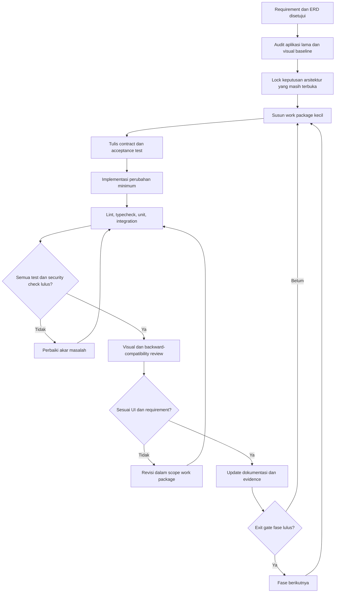
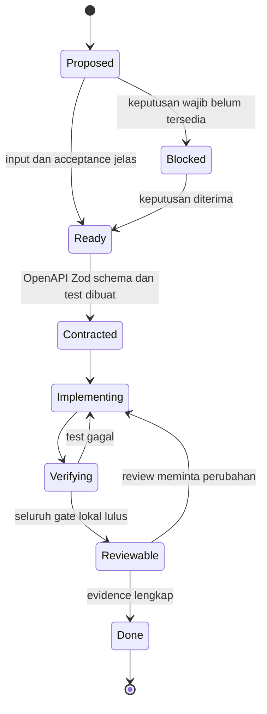
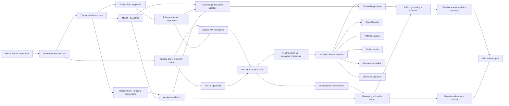
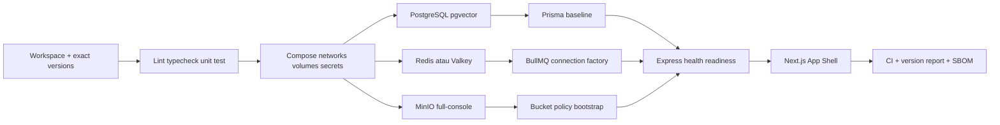
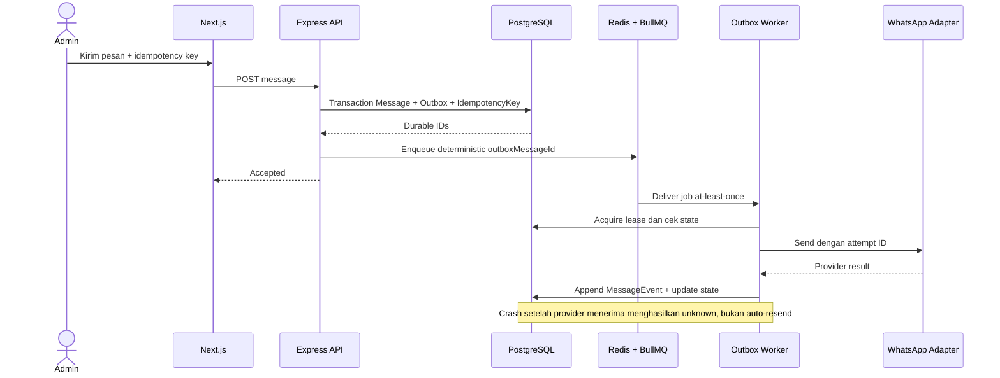
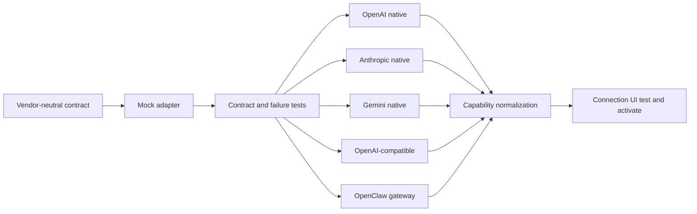
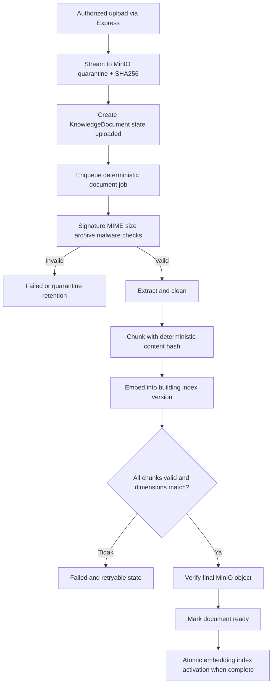
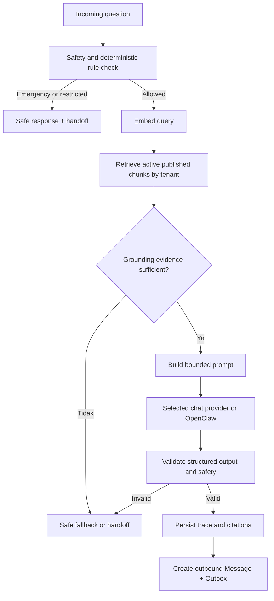
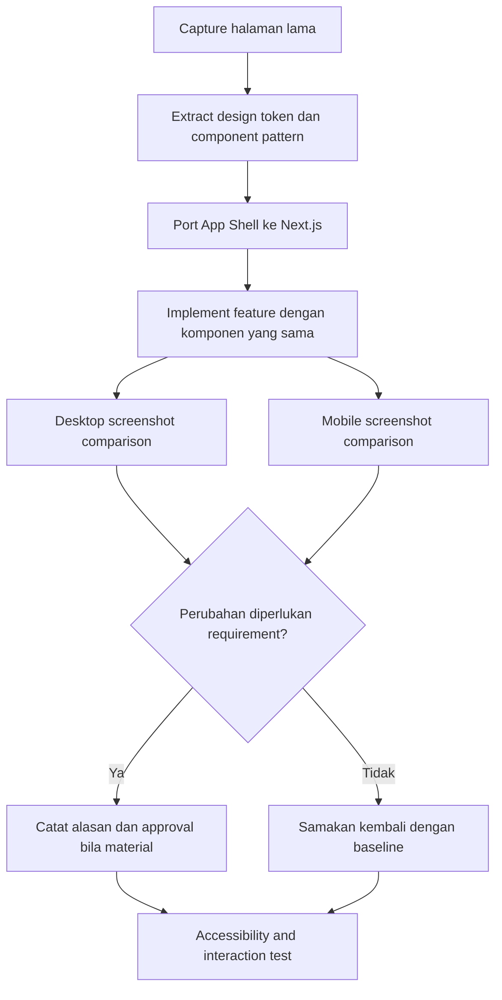

# AI-Generated Development Flow — WhatsApp Chatbot V2

Status: **Aktif — F0–F6 functional complete; formal release gate blocked oleh unmitigated container vulnerabilities**
Versi: **1.5**
Tanggal: **9 Agustus 2026**
Input utama: [REQUIREMENTS.md](./REQUIREMENTS.md) dan [ERD.md](./ERD.md)  
Target: AI coding agent dapat mengimplementasikan aplikasi secara bertahap, dapat diuji, dan tidak mengubah UI lama secara berlebihan.

## 1. Tujuan flow

Dokumen ini mengatur cara AI coding agent mengubah requirement menjadi source code. Flow ini dirancang agar:

- AI tidak membuat seluruh aplikasi dalam satu perubahan besar.
- Setiap fase mempunyai input, output, dependency, test, dan exit gate yang jelas.
- UI lama menjadi visual baseline; perubahan hanya dilakukan untuk kebutuhan fungsional atau aksesibilitas.
- Database, API, worker, WhatsApp runtime, AI adapter, Redis/BullMQ, dan MinIO memiliki boundary yang dapat diuji.
- Secret tidak masuk source code, log, fixture, screenshot, atau response API.
- Migration bersifat additive dan dapat di-rollback pada fase awal.
- Failure pada provider AI tidak menyebabkan jawaban karangan atau pengiriman WhatsApp ganda.
- AI berhenti dan meminta persetujuan ketika keputusan dapat mengubah arsitektur, data, biaya, lisensi, atau keamanan.

Flow ini **belum mengizinkan deployment production**. Production memerlukan release gate pada PRD, termasuk security exception untuk legacy MinIO full-console.

## 2. Source of truth

AI harus membaca dokumen dalam urutan berikut sebelum membuat perubahan:

1. `REQUIREMENTS.md` — scope, prioritas, arsitektur, versi, security, dan acceptance criteria.
2. `ERD.md` — entity, cardinality, constraint, index, dan retention boundary.
3. Source aplikasi lama:
   - `../whatsapp-chatbot/simple-whatsapp-chatbot`
   - `../whatsapp-chatbot/whatsapp-control-panel`
4. File fase aktif, OpenAPI, Prisma schema, shared contracts, test, dan migration yang sudah dibuat.
5. Keputusan terbaru yang secara eksplisit disetujui pengguna.

Urutan prioritas ketika terjadi konflik:

```text
Keputusan eksplisit terbaru pengguna
  > security dan data-integrity constraint
  > REQUIREMENTS.md
  > ERD.md
  > OpenAPI/Zod contract yang sudah disetujui
  > perilaku aplikasi lama
  > asumsi AI
```

AI tidak boleh diam-diam mengubah requirement agar sesuai dengan implementasi yang lebih mudah. Ketidaksesuaian harus ditulis sebagai decision record atau diajukan untuk persetujuan.

## 3. Alur utama development



Aturan loop:

- AI hanya mengerjakan satu work package aktif pada satu waktu kecuali task benar-benar independen dan tidak menyentuh file/schema yang sama.
- Failure test diperbaiki pada akar masalah; test tidak boleh dihapus, dilemahkan, atau di-skip hanya agar pipeline hijau.
- Refactor besar dipisahkan dari perubahan perilaku, kecuali refactor tersebut benar-benar diperlukan untuk fitur aktif.
- Setiap exit gate menyimpan command, hasil test, migration evidence, dan risiko tersisa.

## 4. State machine work package untuk AI



AI hanya boleh menyatakan work package `Done` jika:

- acceptance criteria work package terbukti lulus;
- lint, typecheck, dan test terkait lulus;
- tidak ada secret atau data sensitif pada diff/log;
- migration telah diuji apply dan rollback/recovery-nya sesuai klasifikasi;
- dokumentasi dan environment example telah diperbarui;
- perubahan visual telah dibandingkan dengan baseline jika menyentuh frontend;
- tidak ada TODO kritis yang disembunyikan sebagai pekerjaan selesai.

## 5. Format work package wajib

Sebelum menulis kode, AI membuat work package dengan format berikut:

```markdown
# WP-<fase>-<nomor> — <nama singkat>

Goal:
Input/source of truth:
Dependency:
File/directory yang boleh berubah:
Perilaku saat ini:
Perilaku yang diinginkan:
Non-goal:
Data/migration impact:
Security/privacy impact:
Acceptance criteria:
Test yang harus dibuat dahulu:
Verification commands:
Rollback/recovery:
Open question/blocker:
```

Ukuran work package yang direkomendasikan:

- satu vertical slice atau satu infrastructure capability;
- idealnya dapat direview tanpa membaca perubahan fase lain;
- tidak mencampur upgrade dependency, migration besar, redesign UI, dan fitur domain dalam satu package;
- memiliki hasil yang dapat dijalankan atau diuji, bukan sekadar banyak file placeholder.

## 6. Dependency map implementasi



Dependency yang tidak boleh dilanggar:

- Frontend memanggil Express API; Next.js tidak membuat business backend kedua.
- BullMQ dipakai setelah durable domain row dibuat di PostgreSQL.
- RAG tidak dibuat sebelum versioned embedding index dan document lifecycle tersedia.
- Real provider tidak diintegrasikan sebelum mock adapter dan contract test lulus.
- WhatsApp outbound tidak dikirim langsung dari request handler; semua pengiriman melalui outbox.
- UI konfigurasi secret tidak dibuat sebagai plaintext read/edit form.
- Presigned MinIO URL tidak diaktifkan sebelum endpoint public HTTPS dan tenant authorization diuji.

## 7. Gate A — Approval dan baseline capture

Status eksekusi: **Passed pada 6 Agustus 2026**. Audit source, visual baseline, dan paket keputusan material telah disetujui; Fase 0 dapat dimulai.

Artifact:

- [Gate A report](./gate-a/GATE_A_REPORT.md)
- [Feature migration matrix](./gate-a/FEATURE_MIGRATION_MATRIX.md)
- [Migration boundary](./gate-a/MIGRATION_BOUNDARY.md)
- [Decision register](./gate-a/DECISION_REGISTER.md)
- [Visual baseline manifest](./gate-a/visual-baseline/MANIFEST.md)

### Input

- PRD versi aktif.
- ERD versi aktif.
- Dua aplikasi lama sebagai referensi perilaku/UI.

### Work package

1. Inventaris halaman, route, komponen, warna, typography, spacing, icon, loading, empty, error, dan responsive state aplikasi lama.
2. Capture screenshot desktop/mobile untuk halaman P0.
3. Inventaris API, database table, WhatsApp session format, environment variable, dan migration lama.
4. Petakan fitur lama menjadi `keep`, `improve`, `migrate`, atau `retire` dengan alasan.
5. Kunci keputusan yang masih terbuka:
   - Redis 8 atau Valkey sebagai datastore BullMQ;
   - UUIDv7 atau UUIDv4;
   - strategi dimensi/partition pgvector;
   - retention per jenis data;
   - PostgreSQL RLS untuk production;
   - domain, TLS, dan private network topology;
   - penerimaan AGPLv3 serta security exception legacy MinIO.

### Exit gate

- Tidak ada P0 route lama yang belum dipetakan.
- Visual baseline dapat dipakai untuk screenshot comparison.
- Tidak ada keputusan kritis yang diasumsikan diam-diam oleh AI.
- Daftar data migration dan rollback boundary disetujui.

## 8. Fase 0 — Foundation dan local platform

Status eksekusi: **F0-WP01 sampai F0-WP08 selesai**. Functional gate lokal dan host-version gate lulus pada 8 Agustus 2026. Authorized Docker Scout scan pada 11 Agustus 2026 selesai, tetapi Gate Fase 0 tetap **Blocked oleh unmitigated container vulnerabilities**: lima image menghasilkan total 31 Critical dan 110 High occurrence. Evidence berada di `work-packages/F0-GATE.md` dan `docs/security/CONTAINER_VULNERABILITY_INVENTORY.md`.

### Urutan implementasi



### Work package minimum

1. **F0-WP01 Monorepo**  
   Buat workspace `apps/web`, `apps/api`, `apps/worker`, `apps/whatsapp`, `packages/contracts`, `packages/config`, `packages/db`, `packages/ui`, dan `packages/testing` sesuai kebutuhan nyata. Pin versi dari PRD.

2. **F0-WP02 Quality baseline**  
   Strict TypeScript, formatter, lint, unit test runner, integration test convention, dependency/license scan, dan CI tanpa placeholder pass.

3. **F0-WP03 Compose infrastructure**  
   Satu proyek Compose, tetapi PostgreSQL, Redis/Valkey, MinIO, API, worker, web, dan WhatsApp tetap container/service terpisah. Gunakan network internal dan named volume.

4. **F0-WP04 Database baseline**  
   Implementasikan Prisma schema dari ERD secara bertahap. Pgvector extension/index dibuat dengan migration SQL eksplisit. Migration pertama harus additive.

5. **F0-WP05 Queue foundation**  
   Buat connection factory producer dan worker. BullMQ adalah dependency aplikasi Node.js, bukan container mandiri. Tambahkan deterministic `jobId`, graceful shutdown, readiness, dan test Redis restart.

6. **F0-WP06 MinIO foundation**  
   Gunakan `RELEASE.2025-04-22T22-12-26Z` + Console `v1.7.6`, image internal `raho-minio-full:2025-04-22-r<N>`, `MINIO_BROWSER=on`, console private port `9001`, bootstrap bucket/policy/versioning/lifecycle, dan named operator credential. Unmodified legacy image hanya untuk local-only.

7. **F0-WP07 Shared contracts**  
   Buat error envelope, pagination, request metadata, health contract, enum domain, dan Zod validation yang dipakai web/API/worker.

8. **F0-WP08 App Shell**  
   Port design token dan layout lama ke Next.js App Router tanpa redesign. Semua halaman yang belum aktif menggunakan state jelas, bukan fake functionality.

### Test gate

- Fresh clone dapat start local stack melalui documented Compose command.
- Semua service memiliki live/readiness check yang bermakna.
- PostgreSQL version, pgvector extension, queue server, MinIO release, dan Console version cocok dengan version matrix.
- MinIO smoke test memverifikasi bucket/object/version/lifecycle/IAM, bukan hanya HTTP 200.
- Restart Redis/worker tidak menghilangkan PostgreSQL durable state.
- Lint, typecheck, unit, integration, license scan, dan container scan menghasilkan evidence.

## 9. Fase 1 — Auth, RBAC, audit, dan operational shell

Status eksekusi: **Functional complete; formal gate blocked oleh inherited F0 unmitigated container vulnerabilities**. F1-WP01 sampai F1-WP08 Done; auth/RBAC/audit, retention, QR ephemeral Baileys, worker safety enforcement, permission/IDOR matrix, SSE replay, explicit metric availability, recovery/UAT, serta visual/accessibility regression telah lulus. Evidence rinci berada pada `work-packages/F1-WP01.md` sampai `F1-WP08.md` dan `work-packages/F1-GATE.md`.

### Work package minimum

1. Admin user, tenant, membership, seed/bootstrap admin tanpa password hardcoded.
2. Login/logout/session expiry/revocation dengan opaque cookie `HttpOnly`, `Secure`, dan CSRF.
3. Permission middleware dan tenant context pada Express.
4. Append-only audit log untuk login, secret mutation, safety action, session reset, dan publish action.
5. Overview dependency status dan SSE dengan fallback polling.
6. WhatsApp session state API dan QR short-lived tanpa persistence/logging.
7. Safety state: pause/resume/kill switch dengan reason, permission, revision, dan audit.
8. Port halaman login, overview, session, dan safety mengikuti visual baseline.

### Test gate

- Cross-tenant IDOR test dan permission matrix lulus.
- Browser tidak menerima session token dalam JSON/local storage.
- CSRF, login rate limit, session fixation, logout, dan password change invalidation lulus.
- QR, cookie, auth state, password, dan secret tidak muncul dalam log/test artifact.
- Visual regression halaman P0 berada dalam tolerance yang disetujui.

## 10. Fase 2 — Messaging parity dan durable outbox

Status eksekusi: **Functional complete; formal gate blocked oleh inherited F0 unmitigated container vulnerabilities**. F2-WP01 sampai F2-WP08 Done; contact/conversation, inbound dedupe, transactional compose, durable outbox recovery, handoff, ordered rules, operational UI, OpenAPI, IDOR/security, visual/accessibility, dan failure-injection acceptance telah lulus. Evidence rinci berada pada `work-packages/F2-WP01.md` sampai `F2-WP08.md` dan `work-packages/F2-GATE.md`.

### Alur message outbound



### Work package minimum

1. Contact normalization dan duplicate prevention.
2. Conversation list/detail dengan cursor pagination.
3. Incoming message ingestion dengan provider event idempotency.
4. Manual compose yang membuat `Message`, `OutboxMessage`, dan `IdempotencyKey` dalam satu transaction.
5. Outbox dispatcher, lease, retry, failed/unknown reconciliation, dan immutable event timeline.
6. Human handoff dengan unique active reason dan ownership mode.
7. Ordered chatbot rule versioning, atomic publish, deterministic routing, dan fallback.
8. Inbox, contact, compose, timeline, outbox, handoff, safety, dan rule UI sesuai baseline.

### Test gate

- Duplicate HTTP request tidak membuat pesan kedua.
- Duplicate provider event tidak membuat incoming message kedua.
- Redis restart dapat direkonsiliasi dari PostgreSQL.
- Worker crash sebelum send boleh retry; crash setelah provider menerima tidak auto-resend dan menghasilkan `unknown`.
- AI/manual/rule message semuanya melewati outbox yang sama.
- Playground tidak dapat menjadi penerima WhatsApp.

## 11. Fase 3 — AI configuration dan multi-provider adapter

Status eksekusi: **Functional complete; formal gate blocked oleh inherited F0 unmitigated container vulnerabilities**. F3-WP01 sampai F3-WP08 Done; vendor-neutral contract, encrypted credential envelope, SSRF-safe pinned transport, native/compatible/OpenClaw adapter, capability/test/activation repository, UI chat dan embedding terpisah, OpenAPI, RBAC/IDOR, visual/accessibility, serta acceptance smoke telah lulus pada 10 Agustus 2026. Evidence rinci berada pada `work-packages/F3-WP01.md` sampai `F3-WP08.md` dan `work-packages/F3-GATE.md`.

### Urutan adapter



### Work package minimum

1. `ChatProvider` dan `EmbeddingProvider` contract dengan normalized error/usage/capability.
2. Mock server/adapter untuk success, malformed output, 401, 403, 404 model, 429, timeout, dan 5xx.
3. Encrypted credential envelope dan master key dari environment/secret manager.
4. SSRF-safe outbound client: protocol, hostname, DNS/IP, redirect, port, timeout, size, dan egress policy.
5. OpenAI native chat/embedding adapter.
6. Anthropic native Messages adapter; UI menolak Anthropic native sebagai embedding provider.
7. Gemini native chat/embedding adapter.
8. OpenAI-compatible adapter dengan validated editable Base URL.
9. OpenClaw Gateway adapter menggunakan private `/v1`, bearer token, dan stable tenant/conversation session key.
10. Capability cache, model list/manual input, provider-specific parameter mapping, connection test, explicit activation, and audit.
11. UI connection untuk chat dan embedding secara terpisah; secret kosong tidak berarti delete dan secret tersimpan tidak dapat dibaca kembali.

### Test gate per adapter

- Auth dan base URL test dilakukan server-to-server.
- Structured output lolos schema internal atau menghasilkan safe failure.
- Error vendor dipetakan tanpa raw response/secret leakage.
- Unsupported parameter tidak dikirim.
- Usage, latency, sanitized request ID, dan model aktual tercatat.
- Provider chat dan embedding dapat berasal dari vendor berbeda.
- OpenClaw tidak mendapat shell/filesystem/browser/admin tool dari aplikasi ini.
- Mengganti connection memerlukan test ulang, revision check, audit, dan explicit activation.

AI tidak boleh memakai real API key pada automated test. Fixture/mock menjadi default; live-provider smoke test dijalankan manual/secret CI environment dengan budget limit.

## 12. Fase 4 — Knowledge, MinIO document pipeline, dan RAG

Status eksekusi: **Functional complete; formal gate blocked oleh inherited F0 unmitigated container vulnerabilities**. F4-WP01 sampai F4-WP09 Done; knowledge governance, authorized private document transfer, quarantine/validation/extraction, versioned pgvector indexing dengan atomic cutover, strict-grounding RAG, citation trace, inbound AI outbox/handoff, serta operational UI telah lulus pada 10 Agustus 2026. Evidence rinci berada pada `work-packages/F4-WP01.md` sampai `F4-WP09.md` dan `work-packages/F4-GATE.md`.

### Document pipeline



### RAG answer flow



### Work package minimum

1. Category, item, version, question variant, governance lifecycle, dan publish rules.
2. Authorized document upload/download melalui Express.
3. MinIO quarantine/final/export object repository dan reconciliation.
4. File validation, extraction, cleaning, chunking, retry, orphan sweeper, dan lifecycle.
5. Versioned embedding index dan pgvector query dengan mandatory tenant/published filter.
6. Re-embedding progress dan atomic cutover; index lama tetap aktif sampai index baru complete.
7. Prompt version, safety policy, bounded memory, strict grounding, output validation, and response cache invalidation.
8. Trace, citations, source preview, search test, and safe fallback/handoff.
9. Knowledge/document/search/trace UI mengikuti komponen lama dan hanya menambah field baru yang diperlukan.

### Test gate

- Invalid file tidak pernah masuk extraction/embedding.
- Browser tidak menerima MinIO credential dan tidak dapat mengambil object lintas tenant.
- Retry pipeline tidak membuat duplicate final object atau chunk logis.
- Vector dengan dimensi salah ditolak sebelum activation.
- Retrieval hanya memakai tenant, published source, dan active embedding index yang benar.
- Pertanyaan unsupported/emergency menghasilkan fallback atau handoff, bukan hallucination.
- Citation yang disimpan benar-benar menunjuk chunk yang diberikan ke model.

## 13. Fase 5 — AI operations, migration, dan pilot

Status eksekusi: **Functional complete; pilot gate blocked oleh unmitigated container vulnerabilities**. F5-WP01 sampai F5-WP09 Done; WP10 menyelesaikan authorized inventory pada 11 Agustus 2026. Kelima image gagal policy, dan hardened legacy MinIO exception ditolak karena authentication bypass S3 umum yang belum dipatch. Feedback, unanswered, evaluation, analytics, trace/alert, backup/restore, migration checkpoint, shadow read, cutover, rollback, dan UI telah lulus pada 10 Agustus 2026. Evidence rinci berada pada `work-packages/F5-WP01.md` sampai `F5-WP10.md`, `work-packages/F5-GATE.md`, dan `docs/security/CONTAINER_VULNERABILITY_INVENTORY.md`.

### Work package minimum

1. Admin feedback dan append-only review audit.
2. Unanswered question aggregation dan occurrence.
3. Test case, test run, evaluation report, dan release-readiness gate.
4. Analytics provider latency/error/usage/cost, cache, fallback, handoff, dan queue age tanpa PII.
5. Alert, OpenTelemetry-ready traces, backup, restore drill, dan operational runbook.
6. Data migration tool dengan dry-run, checksum/count, quarantine report, dan resumable checkpoint.
7. Shadow read pada database clone dan comparison report.
8. Cutover rehearsal: pause sending, drain/reconcile outbox, single WhatsApp runtime, migrate, verify, resume terpisah.
9. Rollback rehearsal untuk application version dan backward-compatible schema.
10. Security review dan vulnerability register legacy MinIO.

### Pilot release gate

Pilot hanya boleh dibuka ketika seluruh acceptance criteria PRD lulus, termasuk:

- native OpenAI, Anthropic, dan Gemini contract test;
- OpenAI-compatible dan OpenClaw private gateway test;
- duplicate-send/failure injection test;
- MinIO full-console capability smoke test dan hardened-image exception;
- cross-tenant, RBAC, CSRF, SSRF, upload, credential, dan log-redaction test;
- visual regression dan accessibility test halaman kritis;
- migration, backup/restore, rollback, dan single-runtime cutover rehearsal;
- exact version report, SBOM, license scan, dan no-floating-image check.

## 14. Fase 6 — Message template P1

Fase ini dimulai setelah P0 pilot stabil kecuali pengguna menaikkan prioritasnya.

Status eksekusi: **Functional complete; formal pilot blocked oleh unmitigated container vulnerabilities Fase 5**. Pengguna menaikkan prioritas Fase 6 pada 10 Agustus 2026. Template CRUD/version lifecycle, allowlisted variable preview, versioned checklist, atomic immutable compose snapshot, required-checklist outbox gate, template/compose UI, RBAC/IDOR/OpenAPI, visual, accessibility, dan runtime acceptance telah lulus. Evidence berada di `work-packages/F6-WP01.md` sampai `F6-WP07.md` dan `work-packages/F6-GATE.md`.

1. Template CRUD dan version lifecycle.
2. Variable schema dan preview rendering.
3. Versioned checklist item.
4. Immutable message template/checklist snapshot pada compose.
5. Block outbox jika required checklist belum terpenuhi.
6. UI template dan compose integration tanpa mengubah navigasi utama.
7. Unit, integration, snapshot immutability, RBAC, dan visual regression test.

## 15. Urutan test yang harus dijalankan AI

Untuk setiap work package, AI menjalankan test dari yang paling cepat dan lokal:

```text
1. Static checks pada file yang berubah
2. Unit test terfokus
3. Typecheck package terkait
4. Integration test dependency terkait
5. Contract/API test
6. End-to-end alur terkait
7. Failure-injection/security test bila relevan
8. Visual regression/accessibility bila menyentuh UI
9. Full workspace regression sebelum exit gate fase
```

Jika command belum tersedia, AI boleh membuat command tersebut sebagai bagian Foundation. AI tidak boleh mengklaim “test lulus” jika test tidak dijalankan; status yang benar adalah “belum dijalankan” beserta alasannya.

## 16. Security checkpoints untuk AI

AI melakukan checkpoint berikut sebelum menyelesaikan setiap package:

- **Auth:** endpoint memiliki auth, tenant context, permission, dan CSRF sesuai jenis request.
- **IDOR:** semua resource lookup memfilter `tenantId`, bukan hanya primary key.
- **Secret:** tidak ada key/token/password/QR/auth state di diff, fixture, response, log, URL, atau screenshot.
- **SSRF:** provider Base URL tidak langsung diberikan ke generic HTTP client tanpa validation.
- **Upload:** filename tidak dipercaya, signature/MIME/size diverifikasi, dan object masuk quarantine.
- **Queue:** handler idempotent dan menganggap delivery at-least-once.
- **Outbound:** WhatsApp send selalu melalui durable outbox.
- **AI:** model output dianggap untrusted dan divalidasi; knowledge dianggap data, bukan instruction.
- **Storage:** browser tidak memiliki MinIO service account; Console private dan root bukan credential harian.
- **Database:** tidak ada destructive migration otomatis atau cascade yang menghilangkan audit/history.
- **Logging:** raw provider error/body dan PII tidak ditulis ke operational log.

## 17. UI preservation flow



AI boleh melakukan perbaikan kecil berikut tanpa redesign:

- loading, error, empty, stale, degraded, dan retry state yang sebelumnya tidak jelas;
- keyboard navigation, label, focus, contrast, dan responsive correction;
- field konfigurasi provider, embedding, OpenClaw, dan MinIO status yang dibutuhkan requirement;
- konsistensi spacing/token ketika aplikasi lama tidak konsisten.

AI harus meminta persetujuan sebelum:

- mengganti navigasi utama;
- mengganti branding, palette utama, typography utama, atau layout seluruh halaman;
- menghapus fitur/route lama;
- memindahkan workflow penting ke pola interaksi yang berbeda.

## 18. Stop conditions — AI wajib berhenti

AI tidak boleh membuat asumsi dan harus meminta keputusan jika menemukan:

1. Perubahan database destructive, kehilangan data, atau migration yang tidak backward-compatible.
2. Kebutuhan membaca/memindahkan secret plaintext dari aplikasi lama.
3. Perubahan UI material di luar requirement.
4. Dependency proprietary/berbayar menjadi runtime wajib.
5. Konflik lisensi atau security advisory High/Critical tanpa mitigasi yang disetujui.
6. Keputusan yang mengubah provider, queue datastore, WhatsApp adapter, object storage, atau deployment topology.
7. Test menunjukkan risiko duplicate WhatsApp send atau cross-tenant data access.
8. Real customer data/API key diperlukan untuk melanjutkan test.
9. Akses eksternal, deployment, DNS, production secret, atau tindakan irreversible yang belum diotorisasi.
10. Requirement, ERD, dan perilaku lama memberikan jawaban yang saling bertentangan dan dampaknya material.

AI boleh melanjutkan dengan asumsi yang dicatat jika asumsi tersebut lokal, reversible, tidak mengubah kontrak publik, dan tidak memengaruhi data, biaya, lisensi, keamanan, atau UI material.

## 19. Definition of Done keseluruhan aplikasi

Aplikasi dinyatakan selesai untuk pilot hanya jika:

- seluruh P0 work package berstatus `Done` dengan evidence;
- exact dependency/image versions cocok dengan PRD dan tidak ada tag floating;
- fresh environment dapat dibangun melalui dokumentasi tanpa langkah rahasia manual;
- Prisma migration dari database kosong dan migration rehearsal dari clone lama lulus;
- unit, integration, contract, E2E, failure injection, security, visual, dan accessibility test kritis lulus;
- provider OpenAI, Anthropic, Gemini, OpenAI-compatible, OpenClaw, dan mock memenuhi contract masing-masing;
- Redis/BullMQ recovery dan WhatsApp idempotency terbukti;
- MinIO bucket/policy/versioning/lifecycle/full-console dan authorized object flow terbukti;
- backup/restore dan rollback rehearsal lulus;
- observability, alert, audit, retention, runbook, SBOM, dan license evidence tersedia;
- seluruh acceptance criteria pada `REQUIREMENTS.md` dipetakan ke test atau bukti manual yang dapat diaudit;
- risiko tersisa ditulis secara eksplisit dan disetujui, bukan disembunyikan sebagai TODO.

## 20. Template prompt eksekusi untuk AI coding agent

Gunakan prompt berikut untuk memulai satu work package, bukan seluruh aplikasi sekaligus:

```text
Anda mengimplementasikan WhatsApp Chatbot V2.

Source of truth wajib dibaca:
1. whatsapp-chatbot-v2/REQUIREMENTS.md
2. whatsapp-chatbot-v2/ERD.md
3. whatsapp-chatbot-v2/AI_DEVELOPMENT_FLOW.md
4. source aplikasi lama hanya sebagai baseline perilaku dan UI

Kerjakan hanya work package: <WP-ID dan nama>.

Sebelum mengubah file:
- jelaskan perilaku saat ini berdasarkan inspeksi source;
- tulis scope, non-goal, dependency, risiko, dan acceptance criteria;
- identifikasi test yang harus dibuat atau diperbarui;
- hentikan pekerjaan bila salah satu stop condition pada development flow terpenuhi.

Saat implementasi:
- pertahankan UI lama kecuali perubahan diperlukan requirement;
- gunakan Express sebagai business API dan Next.js sebagai frontend;
- gunakan Prisma/PostgreSQL sebagai durable source of truth;
- gunakan Redis/Valkey hanya sebagai datastore BullMQ, bukan durable domain state;
- semua WhatsApp outbound harus melalui durable outbox;
- jangan pernah memasukkan secret atau data pelanggan ke source, log, fixture, atau response;
- buat perubahan minimum yang lengkap dan dapat diuji;
- jangan melemahkan test untuk membuat pipeline lulus.

Sebelum menyatakan selesai:
- jalankan test berjenjang yang relevan;
- laporkan command dan hasil aktual;
- lakukan security checkpoint;
- update dokumentasi dan traceability acceptance criteria;
- tulis risiko atau pekerjaan yang benar-benar tersisa.
```

## 21. Traceability yang wajib dipelihara

Saat implementasi dimulai, buat matriks traceability dengan kolom:

| Requirement ID | Work package | API/UI/worker | Entity/migration | Test | Evidence | Status |
|---|---|---|---|---|---|---|
| Contoh: FR-MINIO | F0-WP06 | bootstrap + operator flow | `KnowledgeStorageObject` | integration + smoke | report path | planned |

Matriks tersebut mencegah fitur dianggap selesai hanya karena UI sudah terlihat. Satu requirement baru berstatus selesai setelah seluruh backend, persistence, authorization, failure behavior, dan test yang diperlukan terhubung.
