# Flowchart Aplikasi RAHO WhatsApp Chatbot

Dokumen ini menggambarkan alur aplikasi berdasarkan implementasi yang saat ini ada di repository. Diagram menggunakan sintaks [Mermaid](https://mermaid.js.org/) dan dapat dirender langsung oleh GitHub, GitLab, atau editor Markdown yang mendukung Mermaid.

## 1. Ringkasan arsitektur

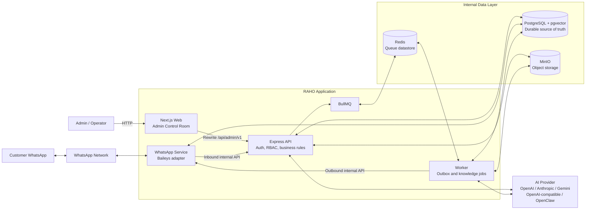

Prinsip utamanya:

1. PostgreSQL adalah sumber data utama. Redis tidak menyimpan state bisnis permanen.
2. Pesan keluar selalu dibuat sebagai record durable di PostgreSQL sebelum dimasukkan ke BullMQ.
3. Service WhatsApp menjadi satu-satunya komponen yang berkomunikasi dengan WhatsApp melalui Baileys.
4. Express API memegang business logic, autentikasi, otorisasi, routing chatbot, dan akses AI.
5. Next.js hanya menjadi frontend dan meneruskan request `/api/admin/*` ke Express API.

## 2. Flow utama aplikasi

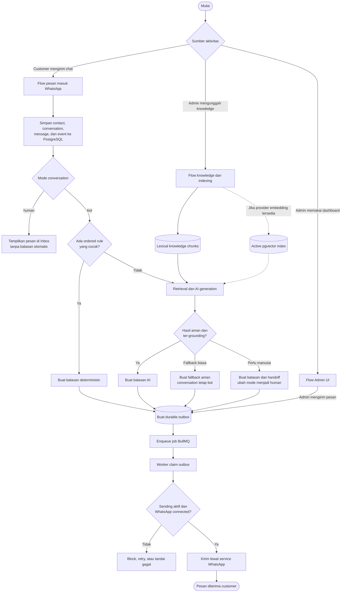

## 3. Flow pesan customer masuk

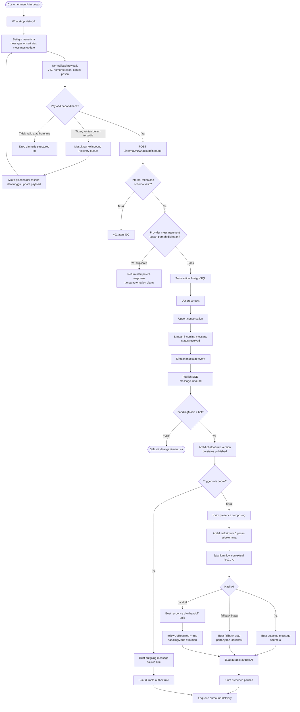

### Urutan keputusan chatbot

Routing balasan otomatis selalu mengikuti urutan berikut:

1. Pesan duplicate tidak diproses ulang.
2. Conversation dengan mode `human` tidak menjalankan rule maupun AI.
3. Conversation dengan mode `bot` mencoba ordered deterministic rule yang sudah dipublish.
4. Jika rule cocok, respons rule langsung dibuat dan AI tidak dijalankan.
5. Jika tidak ada rule yang cocok, aplikasi menjalankan retrieval dan AI.
6. Pertanyaan lanjutan dapat memakai maksimum lima pesan terakhir untuk memahami rujukan; riwayat bukan sumber fakta.
7. Pertanyaan ambigu menghasilkan satu pertanyaan klarifikasi dan conversation tetap dalam mode `bot`.
8. Fallback biasa tidak membuka handoff. Kategori terbatas/darurat atau keputusan eksplisit `handoff` memindahkan conversation ke manusia.

## 4. Sequence pesan masuk sampai balasan keluar

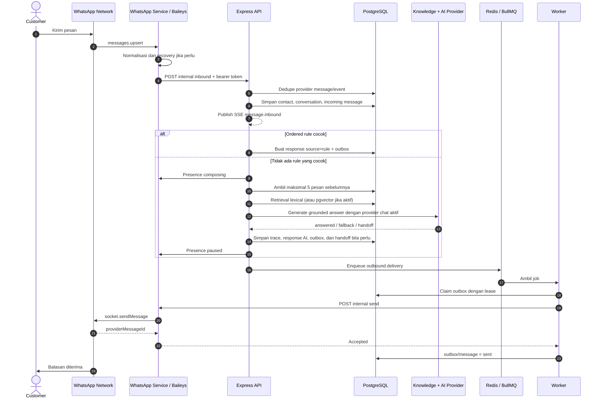

## 5. Flow pesan manual dari Admin UI

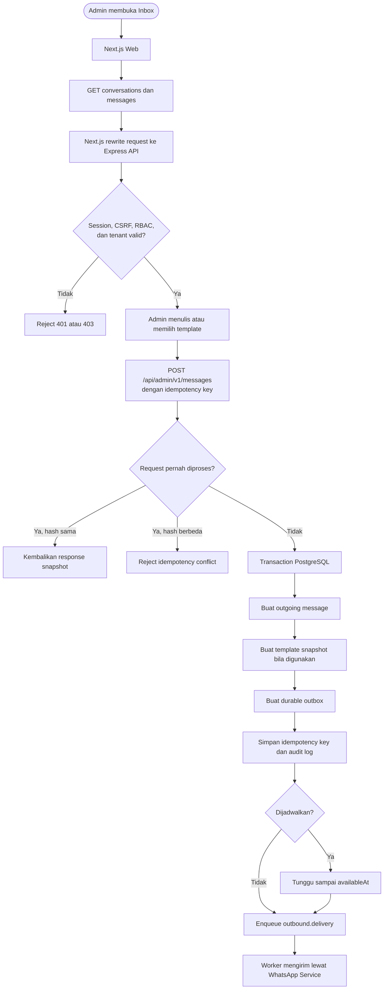

## 6. Flow durable outbox

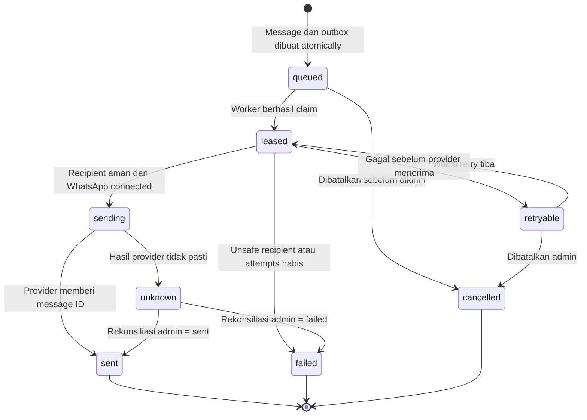

Catatan outbox:

- Message terjadwal tetap memiliki record outbox, tetapi baru dapat di-claim setelah `availableAt` tercapai.
- Job BullMQ hanya membawa identifier durable, bukan isi pesan sebagai source of truth.
- Worker menggunakan lease agar job yang terputus dapat dipulihkan.
- Kegagalan sebelum provider menerima pesan masuk ke `retryable` dengan backoff sampai batas attempt.
- Error setelah proses send dimulai tetapi hasil akhirnya tidak pasti masuk ke `unknown` dan memerlukan rekonsiliasi.
- Safety pause atau kill switch menghentikan delivery sebelum fungsi kirim dijalankan.

## 7. Flow knowledge document dan retrieval index

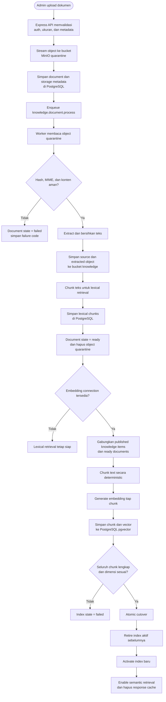

Knowledge item manual yang berstatus `published` dibuat menjadi lexical chunk secara idempotent saat retrieval berjalan. Item `draft` tidak ikut dicari. Embedding index tetap didukung sebagai jalur opsional bila provider embedding tersedia.

## 8. Flow RAG dan AI response

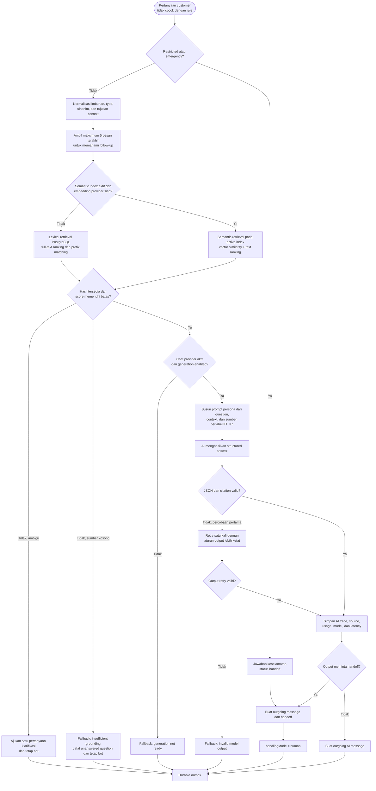

## 9. Flow realtime Inbox

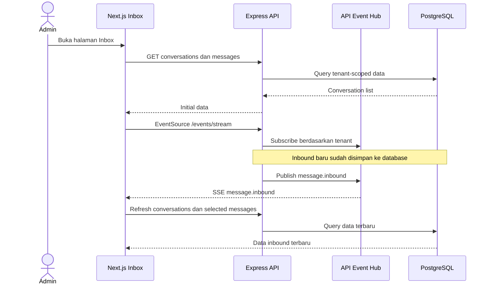

SSE berfungsi sebagai sinyal refresh. Isi conversation dan message tetap dibaca dari PostgreSQL melalui API, bukan dianggap durable hanya karena pernah diterima melalui stream.

## 10. Flow autentikasi dan otorisasi Admin

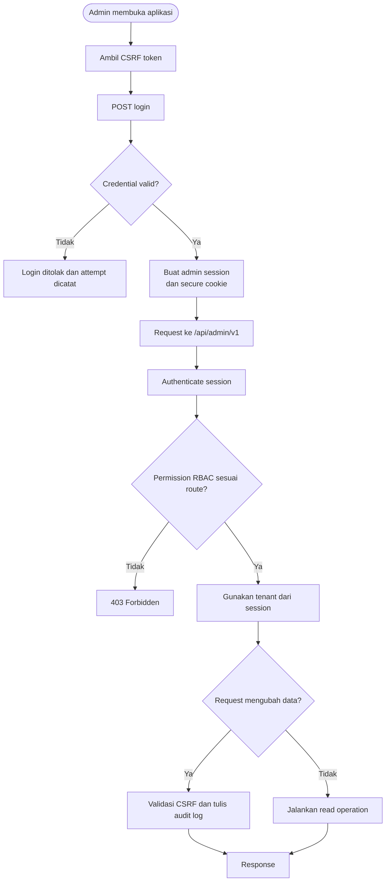

## 11. Service dan tanggung jawabnya

| Service      | Teknologi             | Tanggung jawab utama                                                                                              |
| ------------ | --------------------- | ----------------------------------------------------------------------------------------------------------------- |
| `web`        | Next.js + React       | Admin UI, routing halaman, dan rewrite request API                                                                |
| `api`        | Express + Prisma      | Auth/RBAC, contacts, conversations, chatbot routing, AI/RAG, outbox creation, SSE, dan audit                      |
| `worker`     | BullMQ + Prisma       | Outbox delivery, retry/recovery, retention, document processing, lexical chunking, dan optional embedding reindex |
| `whatsapp`   | Baileys               | QR/session WhatsApp, normalisasi inbound, inbound recovery, dan send message                                      |
| `postgres`   | PostgreSQL + pgvector | Durable business state, audit, message history, AI trace, lexical index, dan optional vector index                |
| `redis`      | Redis                 | Datastore BullMQ dan koordinasi job sementara                                                                     |
| `minio`      | MinIO                 | Quarantine, source/extracted knowledge document, dan export object                                                |
| `minio-init` | MinIO Client          | Bootstrap bucket, policy, lifecycle, dan service account                                                          |

## 12. Network dan persistence Docker Compose

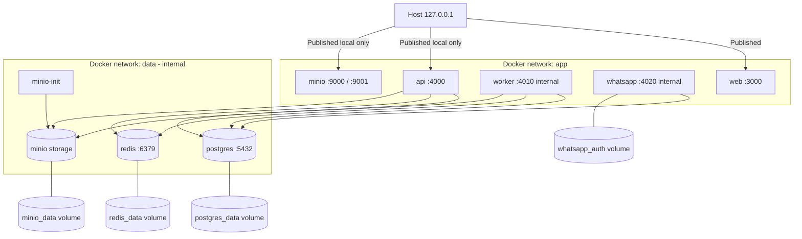

## 13. Referensi implementasi

- Arsitektur container: [`compose.yaml`](./compose.yaml)
- Next.js API rewrite: [`apps/web/next.config.ts`](./apps/web/next.config.ts)
- Express routes dan inbound orchestration: [`apps/api/src/app.ts`](./apps/api/src/app.ts)
- Durable message repository: [`apps/api/src/messaging-repository.ts`](./apps/api/src/messaging-repository.ts)
- Knowledge retrieval dan grounded answer: [`apps/api/src/knowledge-repository.ts`](./apps/api/src/knowledge-repository.ts)
- WhatsApp Baileys adapter: [`apps/whatsapp/src/adapter.ts`](./apps/whatsapp/src/adapter.ts)
- WhatsApp inbound internal client: [`apps/whatsapp/src/inbound.ts`](./apps/whatsapp/src/inbound.ts)
- Worker orchestration: [`apps/worker/src/index.ts`](./apps/worker/src/index.ts)
- Durable outbox delivery: [`apps/worker/src/outbox.ts`](./apps/worker/src/outbox.ts)
- Knowledge document worker: [`apps/worker/src/knowledge.ts`](./apps/worker/src/knowledge.ts)
- BullMQ queue definitions: [`packages/queue/src/queue.ts`](./packages/queue/src/queue.ts)
- Prisma schema: [`packages/db/prisma/schema.prisma`](./packages/db/prisma/schema.prisma)

---

Dokumen ini menjelaskan runtime flow aplikasi. Roadmap, fase pengembangan, quality gate, dan release gate tetap dijelaskan secara terpisah di [`AI_DEVELOPMENT_FLOW.md`](./AI_DEVELOPMENT_FLOW.md).
