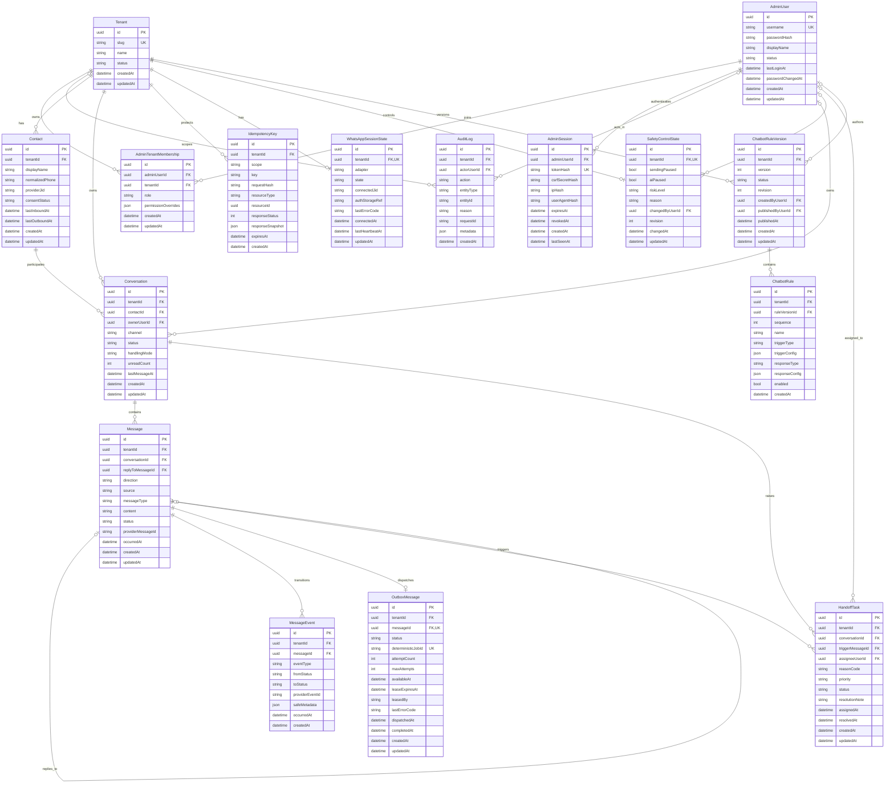
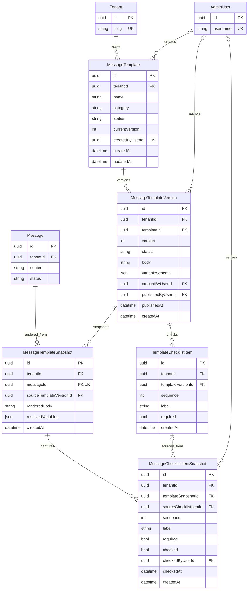

# Entity Relationship Diagram — WhatsApp Chatbot V2

Status: **Approved sebagai baseline Prisma bertahap**  
Versi: **1.1**  
Tanggal: **6 Agustus 2026**  
Database: **PostgreSQL 18 + pgvector 0.8.6**  
ORM: **Prisma 7.9.1**, dengan migration SQL khusus untuk tipe/index pgvector

## 1. Prinsip model data

- Primary key menggunakan UUID/UUIDv7 yang dibuat aplikasi. UUIDv7 direkomendasikan agar index lebih locality-friendly.
- Semua tabel tenant-scoped wajib memiliki `tenantId`, foreign key, dan index dengan `tenantId` sebagai kolom pertama pada query lintas data besar.
- Semua waktu disimpan sebagai `timestamptz` dalam UTC. Nama `datetime` pada diagram dipetakan ke `timestamptz`.
- Nilai uang/biaya tidak memakai floating point; gunakan `decimal` atau satuan integer terkecil.
- Isi secret tidak pernah disimpan plaintext. `AiProviderCredential` hanya menyimpan encrypted envelope dan metadata rotasi.
- Auth material WhatsApp tidak disimpan pada tabel. `WhatsAppSessionState` hanya menyimpan status dan reference ke secure storage.
- File fisik berada di MinIO. PostgreSQL hanya menyimpan metadata dan immutable object identifier pada `KnowledgeStorageObject`.
- BullMQ/Redis bukan source of truth. Status durable tetap berada pada `OutboxMessage`, `Message`, `MessageEvent`, dan tabel domain terkait.
- Record audit, message event, versi yang sudah published, dan snapshot tidak dihapus dengan cascade.
- Field `json` digunakan untuk struktur yang benar-benar provider/dynamic-specific dan tetap divalidasi oleh Zod.

Notasi kardinalitas Mermaid:

| Notasi | Arti |
|---|---|
| `||` | Tepat satu |
| `o|` | Nol atau satu |
| `o{` | Nol atau banyak |
| `|{` | Satu atau banyak |

## 2. Identity, tenancy, WhatsApp, dan chatbot rules

### Constraint utama konteks ini

- `AdminTenantMembership`: unique `(adminUserId, tenantId)`.
- `Contact`: unique `(tenantId, normalizedPhone)` dan unique `(tenantId, providerJid)` untuk nilai non-null.
- `Message`: unique `(tenantId, providerMessageId)` untuk inbound/provider event yang memiliki ID.
- `MessageEvent`: unique partial `(tenantId, providerEventId)` saat `providerEventId` tersedia.
- `OutboxMessage`: unique `messageId` dan unique `(tenantId, deterministicJobId)`.
- `IdempotencyKey`: unique `(tenantId, scope, key)`; row tidak boleh berubah menjadi resource berbeda.
- `HandoffTask`: partial unique untuk `(tenantId, conversationId, reasonCode)` ketika status masih aktif.
- `ChatbotRuleVersion`: unique `(tenantId, version)`; hanya satu versi `published` aktif per tenant.
- `ChatbotRule`: unique `(ruleVersionId, sequence)`.
- `AuditLog.actorUserId`, `Conversation.ownerUserId`, `HandoffTask.assigneeUserId`, dan kolom actor lainnya boleh null untuk system action, tetapi actor type wajib tercatat dalam metadata.
- Relasi polymorphic `IdempotencyKey.resourceType/resourceId` sengaja tidak memakai foreign key; service layer wajib memvalidasi resource dalam tenant yang sama.

## 3. Konfigurasi AI dan provider

```mermaid
erDiagram
    Tenant {
        uuid id PK
        string slug UK
    }

    AiIntegration {
        uuid id PK
        uuid tenantId FK
        string name
        uuid activeChatConnectionId FK
        uuid activeEmbeddingConnectionId FK
        uuid activeEmbeddingIndexVersionId FK
        bool generationEnabled
        bool retrievalEnabled
        bool strictGrounding
        string status
        int revision
        datetime createdAt
        datetime updatedAt
    }

    AiProviderCredential {
        uuid id PK
        uuid tenantId FK
        string providerBinding
        string purpose
        bytes encryptedCiphertext
        bytes encryptedDataKey
        bytes nonce
        string encryptionAlgorithm
        string masterKeyVersion
        string secretFingerprint
        datetime rotatedAt
        datetime revokedAt
        datetime createdAt
        datetime updatedAt
    }

    AiProviderConnection {
        uuid id PK
        uuid tenantId FK
        uuid credentialId FK
        string name
        string purpose
        string provider
        string transport
        string baseUrl
        string modelId
        int dimensions
        string taskType
        int timeoutMs
        int maxRetries
        int maxOutputTokens
        json generationConfig
        string healthState
        datetime lastTestedAt
        int revision
        datetime createdAt
        datetime updatedAt
    }

    AiModelCapabilityCache {
        uuid id PK
        uuid tenantId FK
        uuid connectionId FK
        string modelId
        json capabilities
        string source
        datetime probedAt
        datetime expiresAt
        datetime createdAt
    }

    EmbeddingIndexVersion {
        uuid id PK
        uuid tenantId FK
        uuid providerConnectionId FK
        int version
        string modelId
        int dimensions
        string distanceMetric
        string state
        int totalChunks
        int embeddedChunks
        datetime activatedAt
        datetime retiredAt
        datetime createdAt
        datetime updatedAt
    }

    AiPromptVersion {
        uuid id PK
        uuid tenantId FK
        uuid integrationId FK
        string promptType
        int version
        string status
        string content
        json variablesSchema
        uuid createdByUserId FK
        datetime publishedAt
        datetime createdAt
    }

    AiSafetyPolicy {
        uuid id PK
        uuid tenantId FK
        uuid integrationId FK
        int version
        string status
        json policyConfig
        uuid createdByUserId FK
        datetime publishedAt
        datetime createdAt
    }

    AiOperationalSettings {
        uuid id PK
        uuid tenantId FK
        uuid integrationId FK,UK
        int memoryTurnLimit
        int contextTokenLimit
        int retrievalTopK
        decimal similarityThreshold
        int dailyBudgetMinor
        string budgetCurrency
        int rateLimitPerMinute
        int revision
        datetime updatedAt
    }

    Tenant ||--o{ AiIntegration : owns
    Tenant ||--o{ AiProviderCredential : secures
    Tenant ||--o{ AiProviderConnection : configures
    AiProviderCredential o|--o{ AiProviderConnection : authorizes
    AiProviderConnection ||--o{ AiModelCapabilityCache : probes
    AiProviderConnection ||--o{ EmbeddingIndexVersion : builds

    AiProviderConnection o|--o{ AiIntegration : active_chat_for
    AiProviderConnection o|--o{ AiIntegration : active_embedding_for
    EmbeddingIndexVersion o|--o{ AiIntegration : active_index_for

    AiIntegration ||--o{ AiPromptVersion : versions
    AiIntegration ||--o{ AiSafetyPolicy : governs
    AiIntegration ||--o| AiOperationalSettings : configures
```

### Constraint utama konfigurasi AI

- `AiIntegration`: unique `(tenantId, name)` dan pada MVP hanya satu integration berstatus aktif per tenant.
- Active chat connection harus memiliki `purpose=chat`; active embedding connection harus `purpose=embedding`.
- `provider=anthropic` tidak valid untuk connection dengan `purpose=embedding`.
- `baseUrl` hanya editable untuk `openai-compatible` dan `openclaw-gateway`; native provider memakai endpoint resmi dari adapter.
- Connection dan credential yang direferensikan harus berada pada tenant yang sama. Constraint lintas row ini ditegakkan oleh transaction service dan integration test.
- Credential boleh null hanya untuk `mock` atau provider lokal yang secara eksplisit tidak membutuhkan autentikasi.
- Field ciphertext tidak pernah tersedia pada endpoint read. Replace credential membuat envelope baru dan mencatat audit.
- `AiModelCapabilityCache`: unique `(connectionId, modelId)` dan memiliki TTL melalui `expiresAt`.
- `EmbeddingIndexVersion`: unique `(tenantId, version)`; tepat satu versi boleh berstatus `active` per tenant/integration.
- Pergantian model/dimensi membuat versi index baru. `AiIntegration.activeEmbeddingIndexVersionId` baru diganti setelah semua chunk berhasil di-embed dan cutover dilakukan atomic.
- `AiPromptVersion`: unique `(integrationId, promptType, version)`; versi published immutable.
- `AiSafetyPolicy`: unique `(integrationId, version)`; strict grounding untuk domain kesehatan tidak boleh dilemahkan melalui konfigurasi UI.

## 4. Knowledge, MinIO, RAG, dan AI operations

```mermaid
erDiagram
    Tenant {
        uuid id PK
        string slug UK
    }

    Conversation {
        uuid id PK
        uuid tenantId FK
    }

    Message {
        uuid id PK
        uuid tenantId FK
        uuid conversationId FK
    }

    AdminUser {
        uuid id PK
        string username UK
    }

    AiIntegration {
        uuid id PK
        uuid tenantId FK
    }

    AiProviderConnection {
        uuid id PK
        uuid tenantId FK
        string provider
        string modelId
    }

    EmbeddingIndexVersion {
        uuid id PK
        uuid tenantId FK
        string modelId
        int dimensions
        string state
    }

    KnowledgeCategory {
        uuid id PK
        uuid tenantId FK
        uuid parentId FK
        string name
        string slug
        int sequence
        datetime createdAt
        datetime updatedAt
    }

    KnowledgeItem {
        uuid id PK
        uuid tenantId FK
        uuid categoryId FK
        string title
        string lifecycleState
        int currentVersion
        uuid createdByUserId FK
        datetime createdAt
        datetime updatedAt
    }

    KnowledgeItemVersion {
        uuid id PK
        uuid tenantId FK
        uuid itemId FK
        int version
        string status
        string question
        string answer
        json safeMetadata
        uuid createdByUserId FK
        uuid approvedByUserId FK
        datetime approvedAt
        datetime publishedAt
        datetime createdAt
    }

    KnowledgeQuestionVariant {
        uuid id PK
        uuid tenantId FK
        uuid itemVersionId FK
        string question
        int sequence
        datetime createdAt
    }

    KnowledgeDocument {
        uuid id PK
        uuid tenantId FK
        uuid categoryId FK
        string title
        string originalFilename
        string detectedMime
        int sizeBytes
        string sha256
        string pipelineState
        string failureCode
        uuid uploadedByUserId FK
        datetime queuedAt
        datetime readyAt
        datetime archivedAt
        datetime createdAt
        datetime updatedAt
    }

    KnowledgeStorageObject {
        uuid id PK
        uuid tenantId FK
        uuid documentId FK
        string objectRole
        string bucket
        string objectKey
        string versionId
        string etag
        string sha256
        int sizeBytes
        string detectedMime
        string storageState
        string deletionState
        datetime createdAt
        datetime verifiedAt
        datetime deletedAt
    }

    KnowledgeChunk {
        uuid id PK
        uuid tenantId FK
        uuid documentId FK
        uuid itemVersionId FK
        uuid embeddingIndexVersionId FK
        int sequence
        string content
        string contentHash
        int tokenCount
        vector embedding
        json safeMetadata
        datetime createdAt
    }

    AiEmbeddingUsageLog {
        uuid id PK
        uuid tenantId FK
        uuid providerConnectionId FK
        uuid embeddingIndexVersionId FK
        uuid documentId FK
        string operation
        string modelId
        int inputTokens
        int vectorCount
        int latencyMs
        string status
        string providerRequestId
        datetime createdAt
    }

    AiConversation {
        uuid id PK
        uuid tenantId FK
        uuid conversationId FK
        uuid integrationId FK
        string channel
        string stableSessionKey
        string status
        datetime startedAt
        datetime endedAt
        datetime createdAt
    }

    AiMessageTrace {
        uuid id PK
        uuid tenantId FK
        uuid aiConversationId FK
        uuid messageId FK
        uuid providerConnectionId FK
        string provider
        string transport
        string modelId
        string providerRequestId
        string outcome
        string fallbackReason
        int inputTokens
        int outputTokens
        int cachedTokens
        int latencyMs
        int costMinor
        string costCurrency
        json safeMetadata
        datetime createdAt
    }

    AiMessageSource {
        uuid id PK
        uuid tenantId FK
        uuid traceId FK
        uuid chunkId FK
        int rank
        decimal similarity
        string citationLabel
        datetime createdAt
    }

    AiAdminFeedback {
        uuid id PK
        uuid tenantId FK
        uuid traceId FK
        uuid reviewerUserId FK
        string rating
        string category
        string note
        datetime createdAt
    }

    UnansweredQuestion {
        uuid id PK
        uuid tenantId FK
        string normalizedQuestionHash
        string representativeQuestion
        string status
        int occurrenceCount
        uuid resolvedByItemId FK
        datetime firstSeenAt
        datetime lastSeenAt
        datetime resolvedAt
        datetime createdAt
    }

    UnansweredQuestionOccurrence {
        uuid id PK
        uuid tenantId FK
        uuid unansweredQuestionId FK
        uuid traceId FK
        uuid conversationId FK
        datetime occurredAt
    }

    AiTestCase {
        uuid id PK
        uuid tenantId FK
        string name
        string input
        json expectedBehavior
        string status
        uuid createdByUserId FK
        datetime createdAt
        datetime updatedAt
    }

    AiTestRun {
        uuid id PK
        uuid tenantId FK
        uuid testCaseId FK
        uuid integrationId FK
        string status
        json actualResult
        json assertionResult
        int latencyMs
        datetime startedAt
        datetime finishedAt
    }

    AiResponseCache {
        uuid id PK
        uuid tenantId FK
        uuid integrationId FK
        uuid providerConnectionId FK
        string cacheKey
        string knowledgeRevisionHash
        string response
        json sourceSnapshot
        datetime expiresAt
        datetime createdAt
    }

    AiReleaseReadiness {
        uuid id PK
        uuid tenantId FK
        uuid integrationId FK
        int revision
        string status
        json gateResults
        uuid decidedByUserId FK
        datetime evaluatedAt
        datetime decidedAt
        datetime createdAt
    }

    AiEvaluationReport {
        uuid id PK
        uuid tenantId FK
        uuid readinessId FK
        string reportType
        int totalCases
        int passedCases
        int failedCases
        decimal score
        json metrics
        datetime createdAt
    }

    Tenant ||--o{ KnowledgeCategory : owns
    KnowledgeCategory o|--o{ KnowledgeCategory : parent_of
    KnowledgeCategory ||--o{ KnowledgeItem : classifies
    KnowledgeItem ||--o{ KnowledgeItemVersion : versions
    KnowledgeItemVersion ||--o{ KnowledgeQuestionVariant : varies
    AdminUser o|--o{ KnowledgeItem : creates
    AdminUser o|--o{ KnowledgeItemVersion : authors

    KnowledgeCategory o|--o{ KnowledgeDocument : classifies
    AdminUser o|--o{ KnowledgeDocument : uploads
    KnowledgeDocument ||--o{ KnowledgeStorageObject : maps_to_minio
    KnowledgeDocument o|--o{ KnowledgeChunk : extracts
    KnowledgeItemVersion o|--o{ KnowledgeChunk : chunks
    EmbeddingIndexVersion ||--o{ KnowledgeChunk : embeds

    AiProviderConnection ||--o{ AiEmbeddingUsageLog : records
    EmbeddingIndexVersion ||--o{ AiEmbeddingUsageLog : accounts
    KnowledgeDocument o|--o{ AiEmbeddingUsageLog : consumes

    Tenant ||--o{ AiConversation : owns
    Conversation o|--o{ AiConversation : drives
    AiIntegration ||--o{ AiConversation : configures
    AiConversation ||--o{ AiMessageTrace : traces
    Message o|--o{ AiMessageTrace : materializes
    AiProviderConnection ||--o{ AiMessageTrace : invokes
    AiMessageTrace ||--o{ AiMessageSource : cites
    KnowledgeChunk ||--o{ AiMessageSource : sourced_by
    AiMessageTrace ||--o{ AiAdminFeedback : reviewed
    AdminUser ||--o{ AiAdminFeedback : reviews

    Tenant ||--o{ UnansweredQuestion : aggregates
    UnansweredQuestion ||--o{ UnansweredQuestionOccurrence : occurs
    AiMessageTrace o|--o{ UnansweredQuestionOccurrence : detects
    Conversation o|--o{ UnansweredQuestionOccurrence : observed_in
    KnowledgeItem o|--o{ UnansweredQuestion : resolves

    Tenant ||--o{ AiTestCase : owns
    AiTestCase ||--o{ AiTestRun : executes
    AiIntegration ||--o{ AiTestRun : tested_with
    AiIntegration ||--o{ AiResponseCache : caches
    AiProviderConnection ||--o{ AiResponseCache : generated_by
    AiIntegration ||--o{ AiReleaseReadiness : gates
    AiReleaseReadiness ||--o{ AiEvaluationReport : summarizes
    AdminUser o|--o{ AiReleaseReadiness : decides
```

### Constraint utama knowledge dan AI operations

- `KnowledgeCategory`: unique `(tenantId, slug)`; parent harus berada dalam tenant yang sama dan tidak boleh membentuk cycle.
- `KnowledgeItemVersion`: unique `(itemId, version)`; row published immutable.
- `KnowledgeQuestionVariant`: unique normalized question per `itemVersionId`.
- `KnowledgeDocument.sha256` dipakai untuk deteksi duplikasi, tetapi bukan global unique karena dokumen yang sama boleh dimiliki tenant berbeda.
- `KnowledgeStorageObject`: unique `(bucket, objectKey, versionId)` dan immutable setelah diverifikasi. `objectRole` membedakan `source`, `extracted`, atau artifact lain.
- `KnowledgeStorageObject.objectKey` tidak berisi PII, nomor telepon, tenant name, filename asli, atau secret.
- `KnowledgeChunk` wajib memiliki tepat satu sumber: `documentId` XOR `itemVersionId`. Constraint dibuat dengan SQL `CHECK` migration.
- `KnowledgeChunk`: unique `(embeddingIndexVersionId, documentId, sequence)` atau `(embeddingIndexVersionId, itemVersionId, sequence)` sesuai sumber.
- Kolom `embedding` dibuat sebagai `vector(<dimensions>)`. Karena dimensi dapat berubah antar-index, implementasi dapat memakai tabel per versi dimensi atau kolom vector generik plus check/partition; keputusan fisik dikunci saat spike pgvector.
- Index pencarian memakai HNSW atau IVFFlat yang sesuai volume data, selalu disertai filter tenant dan `embeddingIndexVersionId` aktif.
- `AiConversation.conversationId` null hanya untuk playground/test. `stableSessionKey` tidak memuat secret dan unique dalam tenant.
- `AiMessageTrace` tidak menyimpan full prompt, response mentah provider, API key, atau error body mentah. Isi pesan tetap berada pada tabel `Message` dengan retention policy.
- `AiMessageSource`: unique `(traceId, rank)` dan unique `(traceId, chunkId)`.
- `AiAdminFeedback`: unique `(traceId, reviewerUserId)` agar satu reviewer memiliki satu keputusan aktif; perubahan dicatat di audit.
- `UnansweredQuestion`: unique `(tenantId, normalizedQuestionHash)`; occurrence bersifat append-only.
- `AiResponseCache`: unique `(tenantId, cacheKey)` dan wajib invalid saat knowledge revision, prompt version, safety policy, model, atau embedding index berubah.
- Semua query retrieval dan analytics wajib memasukkan `tenantId`; tidak boleh bergantung hanya pada ID object yang diterima browser.

## 5. Message templates dan immutable snapshots

### Constraint utama template

- `MessageTemplate`: unique `(tenantId, name)` untuk template aktif/non-archived.
- `MessageTemplateVersion`: unique `(templateId, version)`; versi published immutable.
- `TemplateChecklistItem`: unique `(templateVersionId, sequence)`.
- `MessageTemplateSnapshot.messageId` unique. Snapshot tidak berubah walaupun source template diubah atau diarsipkan.
- `MessageChecklistItemSnapshot` menyimpan label dan requirement pada saat compose; relasi ke source item boleh dipertahankan tetapi source tidak boleh dihapus cascade.
- Message tidak boleh masuk outbox bila checklist required pada snapshot belum checked.

## 6. Relasi lintas bounded context

| Sumber | Target | Fungsi |
|---|---|---|
| `Conversation` | `AiConversation` | Menghubungkan timeline WhatsApp dengan sesi AI; nullable untuk playground. |
| `Message` | `AiMessageTrace` | Menghubungkan pesan yang dihasilkan/dievaluasi dengan trace AI. |
| `AiProviderConnection` | `AiMessageTrace` | Menyimpan provider, transport, dan model aktual yang digunakan. |
| `EmbeddingIndexVersion` | `KnowledgeChunk` | Memastikan retrieval hanya memakai vector dari index aktif yang dimensinya konsisten. |
| `KnowledgeChunk` | `AiMessageSource` | Menyimpan sumber/citation yang benar-benar dipakai untuk jawaban. |
| `Message` | `MessageTemplateSnapshot` | Membekukan template, variable, dan checklist yang dipakai saat pengiriman. |
| `AdminUser` | tabel actor/reviewer | Mendukung ownership dan audit tanpa menghapus histori ketika user dinonaktifkan. |
| `Tenant` | seluruh tabel tenant-scoped | Boundary keamanan utama untuk RBAC, query, unique constraint, retention, dan object key MinIO. |

## 7. Strategi foreign key dan penghapusan

| Jenis relasi | Kebijakan yang direkomendasikan |
|---|---|
| Tenant ke data operasional | `RESTRICT`; tenant dinonaktifkan lalu dipurge melalui workflow terkontrol. |
| Parent mutable ke child mutable | `RESTRICT` atau soft-delete sesuai lifecycle. |
| Versi published ke snapshot/trace/source | `RESTRICT`; tidak ada cascade delete. |
| User ke session | Session boleh dihapus dengan retention job; revocation tetap dilakukan sebelum penghapusan. |
| User ke audit/reviewer/actor | `SET NULL` hanya bila snapshot actor name/type tersimpan; default `RESTRICT` dan user dinonaktifkan. |
| Message ke event/outbox/trace/snapshot | `RESTRICT`; purge harus mengikuti retention workflow berurutan dan audited. |
| Document ke MinIO object metadata/chunk | `RESTRICT`; deletion job menghapus/menandai object terlebih dahulu lalu metadata. |

## 8. Index minimum

Index berikut adalah baseline dan harus divalidasi kembali dengan `EXPLAIN ANALYZE`:

- `Conversation(tenantId, status, lastMessageAt DESC, id)`.
- `Message(tenantId, conversationId, occurredAt DESC, id)`.
- `Message(tenantId, providerMessageId)` partial unique ketika ID tidak null.
- `MessageEvent(tenantId, messageId, occurredAt, id)`.
- `OutboxMessage(tenantId, status, availableAt)` termasuk row queued/retryable.
- `HandoffTask(tenantId, status, priority, createdAt)`.
- `AuditLog(tenantId, createdAt DESC, id)` dan `(actorUserId, createdAt DESC)`.
- `KnowledgeItem(tenantId, lifecycleState, categoryId, updatedAt DESC)`.
- `KnowledgeDocument(tenantId, pipelineState, updatedAt)`.
- `KnowledgeStorageObject(tenantId, documentId, objectRole)`.
- `KnowledgeChunk(tenantId, embeddingIndexVersionId)` plus pgvector ANN index.
- `AiMessageTrace(tenantId, createdAt DESC, provider, outcome)`.
- `UnansweredQuestion(tenantId, status, occurrenceCount DESC, lastSeenAt DESC)`.
- `AiTestRun(tenantId, testCaseId, startedAt DESC)`.

## 9. Tabel yang sengaja tidak dibuat

- Tidak ada tabel Redis job. BullMQ menyimpan job sementara di Redis/Valkey; durable state berada di PostgreSQL.
- Tidak ada tabel MinIO bucket atau binary file. Hanya `KnowledgeStorageObject` yang menyimpan reference object.
- Tidak ada tabel plaintext API key, OpenClaw upstream credential, QR, atau WhatsApp auth state.
- Tidak ada tabel model provider yang dianggap permanen. Daftar model/capability bersifat cache dengan expiry.
- Tidak ada foreign key langsung dari record audit polymorphic ke semua entity karena akan membuat skema rapuh; `entityType/entityId` divalidasi aplikasi.

## 10. Keputusan yang perlu dikunci sebelum migration pertama

1. UUIDv7 dari aplikasi atau UUIDv4 dari database.
2. Strategi pgvector untuk perubahan dimensi: tabel/partition per index version atau mekanisme vector generik yang tervalidasi.
3. Apakah `AdminUser` global lintas tenant tetap dipakai atau user selalu dimiliki satu tenant. ERD ini memakai global user + membership.
4. Retention aktual untuk message, AI trace, audit, idempotency key, cache, dan job history.
5. Apakah production pilot memerlukan PostgreSQL Row-Level Security sebagai defense-in-depth selain tenant filter aplikasi.
6. Enum mana yang dibuat sebagai PostgreSQL enum dan mana yang disimpan sebagai string/check constraint agar migration lebih fleksibel.
