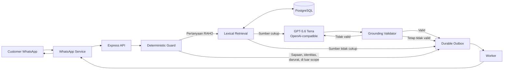
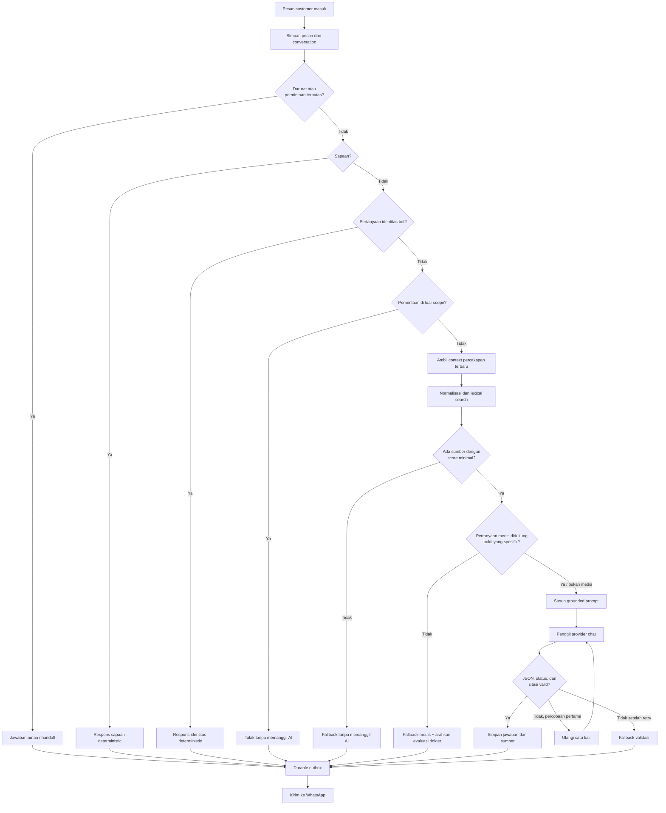

# Arsitektur RAG Chatbot RAHO Premier

Dokumen ini menjelaskan arsitektur Retrieval-Augmented Generation (RAG) yang digunakan chatbot RAHO Premier berdasarkan implementasi saat ini. Sistem menggunakan **lexical RAG + provider chat OpenAI-compatible** dan tidak membutuhkan provider embedding.

## 1. Tujuan arsitektur

Arsitektur ini dirancang agar chatbot:

1. Menjawab informasi RAHO hanya dari knowledge base yang sudah dipublikasikan.
2. Tidak mengarang harga, manfaat, klaim medis, lokasi, jadwal, atau fakta operasional.
3. Menghemat token dengan menangani respons sederhana tanpa memanggil AI.
4. Mengembalikan fallback ketika knowledge tidak cukup.
5. Tetap dapat mengirim jawaban melalui jalur pesan WhatsApp yang durable.

## 2. Ringkasan arsitektur



## 3. Flow lengkap satu pesan



## 4. Deterministic guard

Guard dijalankan sebelum retrieval dan provider AI. Respons dari jalur ini tidak menggunakan token provider.

Urutan pemeriksaannya:

1. **Restricted/emergency** — mendeteksi kondisi seperti sesak napas, nyeri dada, diagnosis, dosis, resep obat, dan kondisi darurat lainnya.
2. **Greeting** — menangani sapaan tunggal maupun gabungan, misalnya `halo`, `selamat sore`, atau `halo selamat sore`.
3. **Assistant identity** — menangani pertanyaan seperti `kamu siapa?`, `ini bot apa?`, dan `saya sedang bicara dengan siapa?`.
4. **Scope guard** — menolak permintaan coding, web app, landing page, debugging, dan pekerjaan software umum.

Contoh respons scope guard:

> Maaf, saya khusus membantu informasi dan layanan RAHO Premier. Saya tidak dapat membuat kode, website, atau tugas umum lainnya.

Trace dari scope guard menggunakan `responseMode: deterministic_scope_guard`, tidak memiliki provider, serta tidak memiliki input/output token.

## 5. Lexical retrieval

Sistem saat ini tidak menggunakan embedding. Pencarian dilakukan secara lexical terhadap chunk knowledge di PostgreSQL.

Tahap retrieval:

1. Pertanyaan dinormalisasi menjadi huruf kecil dan dibersihkan dari karakter yang tidak diperlukan.
2. Stop word percakapan dibuang.
3. Typo umum, imbuhan, alias, dan sinonim tertentu dinormalisasi.
4. Token pencarian diubah menjadi query PostgreSQL full-text search.
5. Sistem mengambil maksimal lima potongan knowledge terbaik.
6. Hasil pertama harus memiliki score minimal `0.1`.

Jika tidak ada sumber yang memenuhi syarat, sistem mengirim fallback tanpa memanggil provider chat.

### Sumber yang digunakan

Hanya knowledge yang sudah masuk ke mekanisme existing dan berstatus **Published** yang boleh menjadi sumber jawaban. Knowledge yang masih draft atau in-review tidak dianggap sebagai source of truth untuk jawaban customer.

Walaupun database menyediakan dukungan `pgvector`, mode chatbot saat ini adalah lexical RAG sehingga vector embedding tidak digunakan dalam jalur utama.

## 6. Context percakapan

Sistem membawa maksimal lima turn terbaru sebagai context. Context digunakan untuk memahami rujukan, bukan sebagai sumber fakta.

Untuk pertanyaan yang bergantung pada percakapan sebelumnya, misalnya:

- `harganya berapa?`
- `terapinya bagaimana?`
- `kalau yang itu bisa homecare?`

sistem dapat menggabungkan pertanyaan sekarang dengan hingga dua pertanyaan customer sebelumnya saat melakukan retrieval.

Fakta tetap harus berasal dari knowledge, bukan dari isi percakapan.

## 7. Grounded prompt

Jika retrieval berhasil, API menyusun prompt yang terdiri dari:

1. Published grounding policy.
2. Runtime policy RAHO.
3. Context percakapan terbaru.
4. Pertanyaan customer.
5. Potongan knowledge berlabel `K1`, `K2`, dan seterusnya.
6. Aturan output dan daftar label sitasi yang diizinkan.

Runtime policy mengharuskan model:

- Menjawab dalam Bahasa Indonesia yang hangat, ringkas, dan natural.
- Tidak mengaku sebagai manusia.
- Menganggap knowledge sebagai satu-satunya source of truth.
- Tidak menambah atau menebak fakta di luar sumber.
- Tidak memberi diagnosis atau rekomendasi medis tanpa bukti.
- Menggunakan handoff hanya saat bantuan manusia benar-benar diperlukan.

## 8. Provider chat

Provider aktif saat ini menggunakan endpoint OpenAI-compatible dan model GPT-5.6 Terra. Request dikirim melalui adapter internal agar implementasi chatbot tidak bergantung langsung pada format satu vendor.

Provider hanya dipanggil jika:

1. Pesan lolos seluruh deterministic guard.
2. Retrieval menemukan sumber yang cukup.
3. Pemeriksaan bukti medis, jika berlaku, dinyatakan cukup.
4. Integrasi chat aktif dan generation diizinkan.

Respons provider diwajibkan berbentuk JSON:

```json
{
  "answer": "Jawaban untuk customer",
  "status": "answered",
  "shouldHandoff": false,
  "citations": ["K1", "K2"]
}
```

## 9. Validasi jawaban

Sebelum jawaban diterima, API memeriksa:

1. Format JSON sesuai schema.
2. Status hanya `answered`, `fallback`, atau `handoff`.
3. Jawaban berstatus `answered` memiliki minimal satu sitasi.
4. Semua sitasi benar-benar berasal dari sumber retrieval.
5. Nilai `shouldHandoff` konsisten dengan status.

Jika output tidak valid, provider dicoba satu kali lagi. Jika percobaan kedua tetap gagal, sistem fail-closed dan mengirim fallback aman.

## 10. Penyimpanan trace dan penggunaan token

Setiap hasil disimpan sebagai AI message trace. Data yang dicatat meliputi:

- Status jawaban.
- Alasan fallback.
- Provider dan model yang digunakan.
- Latency.
- Input token, output token, dan cached token yang dilaporkan provider.
- Label dan chunk sumber.
- Metadata aman seperti retrieval mode dan response mode.

| Jalur                            | Memanggil provider |          Menggunakan token AI |
| -------------------------------- | -----------------: | ----------------------------: |
| Sapaan deterministic             |              Tidak |                         Tidak |
| Identitas chatbot                |              Tidak |                         Tidak |
| Scope guard                      |              Tidak |                         Tidak |
| Retrieval tidak menemukan sumber |              Tidak |                         Tidak |
| Fallback bukti medis             |              Tidak |                         Tidak |
| Jawaban RAG                      |                 Ya |                            Ya |
| Retry output tidak valid         |                 Ya | Ya, dapat terjadi dua request |

Meter token di halaman Analytics menghitung penggunaan yang dilaporkan provider pada trace yang berhasil dicatat. Pemakaian dari aplikasi lain dengan API key yang sama tidak termasuk.

## 11. Pengiriman jawaban

Jawaban tidak dikirim langsung secara fire-and-forget. Sistem membuat record pesan keluar yang durable di PostgreSQL, kemudian worker memproses pengiriman ke WhatsApp.

Pendekatan ini menjaga agar pesan dapat dilacak dan dicoba ulang ketika proses pengiriman mengalami gangguan sementara.

## 12. Batasan lexical RAG

Lexical RAG sederhana dan hemat karena tidak membutuhkan embedding, tetapi memiliki beberapa batasan:

1. Pertanyaan dengan istilah yang sangat berbeda dari knowledge dapat gagal ditemukan.
2. Sinonim dan typo perlu ditambahkan ke normalizer secara manual.
3. Hubungan semantik yang tidak memiliki kata serupa lebih sulit ditemukan.
4. Kualitas jawaban sangat bergantung pada struktur dan kelengkapan knowledge yang dipublikasikan.
5. Perubahan harga atau informasi operasional harus diperbarui di knowledge dan dipublikasikan kembali.

## 13. Checklist operasional

Sebelum chatbot digunakan:

- Pastikan knowledge yang benar sudah berstatus Published.
- Uji pertanyaan utama melalui menu **Uji AI**.
- Pastikan provider chat aktif dan server-side test berhasil.
- Pastikan sesi WhatsApp terhubung.
- Periksa Analytics untuk coverage penggunaan token.
- Periksa Review AI untuk fallback atau jawaban yang perlu ditinjau.
- Uji pertanyaan di luar scope untuk memastikan provider tidak terpanggil.

## 14. Lokasi implementasi utama

- `apps/api/src/knowledge-repository.ts` — guard, lexical retrieval, grounding, validasi, dan trace jawaban.
- `apps/api/src/knowledge-repository.test.ts` — pengujian normalisasi, greeting, identitas, scope guard, dan medical evidence.
- `packages/ai/src/index.ts` — adapter provider dan parsing usage token.
- `apps/api/src/ai-operations-repository.ts` — analytics AI dan agregasi token.
- `packages/db/prisma/schema.prisma` — schema knowledge, chunk, trace, sumber, dan usage.
- `apps/worker/src/outbox.ts` — pemrosesan pesan keluar.
- `apps/whatsapp/src/inbound-message.ts` — penerimaan pesan dari WhatsApp.

## 15. Prinsip utama

```text
Deterministic jika bisa.
Retrieve sebelum generate.
Tidak ada sumber berarti tidak ada panggilan AI.
Tidak ada bukti berarti tidak membuat fakta.
Validasi sebelum kirim.
Simpan secara durable sebelum delivery.
```
