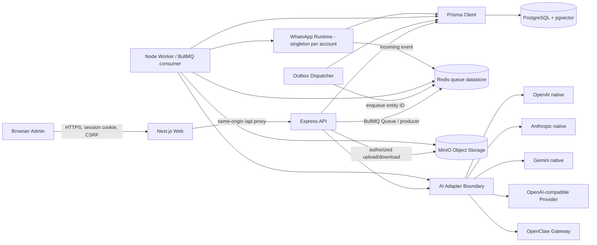

# Product Requirements Document — WhatsApp Chatbot V2

Status: **Approved untuk implementasi bertahap**  
Versi: **1.9**  
Tanggal: **6 Agustus 2026**  
Folder target: `whatsapp-chatbot-v2`  
Baseline: `whatsapp-chatbot/simple-whatsapp-chatbot` dan `whatsapp-chatbot/whatsapp-control-panel`

## 1. Ringkasan keputusan

Aplikasi V2 akan dibuat sebagai monorepo TypeScript dengan:

- **Next.js App Router** untuk frontend/control panel.
- **Express 5** untuk backend API. Express adalah backend, bukan frontend; dokumen ini mengasumsikan kata “front end” kedua pada permintaan awal berarti “backend”.
- **Prisma ORM** untuk model data, migration, dan akses PostgreSQL umum.
- **PostgreSQL + pgvector** untuk data transaksional dan pencarian vektor.
- **Redis** sebagai datastore antrean dan **BullMQ** sebagai library antrean di process API/worker untuk outbox, pemrosesan dokumen, dan pekerjaan asynchronous.
- **MinIO Community full-console** yang dipin ke rilis lama terakhir sebelum pengurangan Console sebagai object storage wajib untuk dokumen knowledge base, bucket karantina, dan export sementara.
- **Baileys** sebagai adapter WhatsApp awal agar kompatibel dengan aplikasi lama, dengan boundary adapter agar WhatsApp Business Cloud API dapat ditambahkan kemudian.
- Adapter AI yang mendukung **OpenAI native**, **Anthropic native**, **Gemini native**, **OpenAI-compatible API**, **OpenClaw Gateway**, dan **mock lokal**.

Tidak ada source code aplikasi yang dibuat pada tahap requirement ini.

Perubahan utama versi 1.2:

- Menambahkan adapter native OpenAI, Anthropic, dan Gemini.
- Memisahkan chat connection dan embedding connection.
- Menambahkan capability detection, provider-specific parameter mapping, dan versioned re-index saat model embedding berubah.
- Memperjelas perbedaan credential Direct Provider dan Via OpenClaw.

Perubahan utama versi 1.3:

- Mengunci MinIO sebagai implementasi object storage.
- Menambahkan bucket topology, least-privilege service account, versioning, lifecycle, checksum, dan authorized download.
- Menambahkan bootstrap dan readiness MinIO pada topologi Docker.

Perubahan utama versi 1.4:

- Menambahkan klasifikasi lisensi, biaya, dan layanan proprietary untuk seluruh komponen utama.
- Menetapkan hanya edisi/core open-source yang boleh menjadi dependency wajib; layanan dan fitur komersial harus opsional.
- Memperjelas pilihan Redis 8 AGPLv3 versus Valkey BSD-3-Clause untuk datastore yang kompatibel dengan BullMQ.
- Menyesuaikan deployment MinIO Community dengan distribusi source-only dan build yang dipin ke source revision terverifikasi.

Perubahan utama versi 1.5:

- Menetapkan baseline versi runtime, framework, database, queue, object storage, WhatsApp adapter, dan OpenClaw per 6 Agustus 2026.
- Melarang tag floating seperti `latest`, `main`, atau major-only pada build dan deployment yang dapat dipromosikan ke production.
- Menandai MinIO Community sebagai upstream yang telah diarsipkan dan menambahkan release gate khusus untuk risiko maintenance/security.

Perubahan utama versi 1.6:

- Mengganti baseline MinIO dari release Community terakhir ke `RELEASE.2025-04-22T22-12-26Z`, yaitu release terakhir sebelum perubahan breaking Console pada 24 Mei 2025.
- Mengunci embedded MinIO Console `v1.7.6` dan mendefinisikan acceptance test untuk fitur administrasi lengkap yang dibutuhkan operator.
- Menambahkan profil image internal hardened, vulnerability register, network isolation, dan release gate untuk penggunaan legacy MinIO.

Perubahan utama versi 1.7:

- Menambahkan ERD logical lengkap yang dibagi berdasarkan bounded context agar tetap terbaca dan dapat diterjemahkan ke Prisma schema.
- Menambahkan tabel pendukung untuk embedding index version, unanswered occurrence, dan AI test run yang dibutuhkan oleh alur requirement.
- Menetapkan constraint, foreign-key policy, immutable snapshot, serta baseline index PostgreSQL/pgvector.

Perubahan utama versi 1.8:

- Menambahkan AI-generated development flow dengan dependency map, work-package state machine, phase gate, dan Definition of Done.
- Menetapkan urutan implementasi/test untuk foundation, messaging, provider AI, MinIO/RAG, migration, dan pilot.
- Menambahkan stop condition, security checkpoint, UI-preservation flow, dan template prompt untuk AI coding agent.

Keputusan deployment antrean: seluruh stack lokal boleh didefinisikan dalam **satu file/proyek Docker Compose**, tetapi Redis dan process aplikasi tetap menjadi service/container terpisah. Redis dan BullMQ **bukan dua aplikasi yang digabung ke satu container**. Redis berjalan sebagai service/container tersendiri. BullMQ di-install sebagai dependency Node.js di image aplikasi; Express menggunakan `Queue` sebagai producer dan process worker menggunakan `Worker` sebagai consumer. Pada development, satu container worker boleh menangani beberapa queue. Pada production, worker dapat dipisah dan diskalakan per jenis pekerjaan tanpa membuat “container BullMQ” khusus.

## 2. Latar belakang

Aplikasi lama sudah memiliki fitur operasional yang luas: login admin, overview, sesi WhatsApp/QR, inbox, kontak, handoff, compose/outbox, aturan chatbot, AI/RAG, knowledge base, dokumen, playground, safety, analytics, audit, dan release readiness. Kekurangan utama yang hendak diperbaiki tanpa redesign besar adalah:

1. Frontend masih React/Vite dengan routing manual, belum memakai Next.js.
2. Query database masih dominan SQL manual melalui `pg`, belum memakai Prisma.
3. `base URL` OpenAI-compatible hanya dapat dikonfigurasi melalui environment server; UI baru menerima API key dan model.
4. Konfigurasi chat dan embedding belum memiliki boundary adapter yang cukup jelas untuk OpenClaw dan provider lain.
5. Struktur proyek, kontrak API, validasi, worker, dan observability perlu disederhanakan agar lebih mudah dirawat.
6. Fitur template pesan yang sudah dirancang perlu dimasukkan ke roadmap V2.

## 3. Tujuan produk

### 3.1 Tujuan utama

- Mencapai feature parity dengan aplikasi lama sebelum menggantikannya.
- Mempertahankan bahasa visual, susunan menu, istilah, dan pola interaksi yang sudah dikenal pengguna.
- Memungkinkan admin memasukkan dan menguji konfigurasi OpenAI, Anthropic, Gemini, OpenAI-compatible, atau OpenClaw melalui UI.
- Menjamin credential AI tidak pernah dikembalikan ke browser setelah disimpan.
- Memisahkan frontend, API, worker, WhatsApp runtime, dan AI provider melalui kontrak yang jelas.
- Mengurangi risiko pesan ganda melalui durable outbox, idempotency, lease, retry, dan reconciliation.
- Mempertahankan strict grounding, safety policy, bounded memory, dan human handoff pada balasan AI.
- Menyediakan migration path dari database dan auth/session aplikasi lama.

### 3.2 Ukuran keberhasilan awal

- Semua alur P0 lulus end-to-end test.
- Tidak ada secret AI, cookie session, QR mentah, atau auth WhatsApp di log maupun response API.
- Tidak ada pengiriman WhatsApp ganda pada retry atau restart worker dalam skenario pengujian.
- P95 read API lokal/staging di bawah 500 ms, tidak termasuk layanan eksternal.
- P95 pembuatan balasan AI di bawah 15 detik atau berakhir dengan fallback yang aman.
- Perbedaan visual halaman utama terhadap aplikasi lama terbatas pada perbaikan kecil dan field konfigurasi baru.

## 4. Non-goal

- Broadcast, scraping, spam, atau pengiriman tanpa consent.
- Campaign massal, import penerima massal, dan A/B testing pada MVP.
- Mengelola seluruh konfigurasi host OpenClaw dari website ini.
- Memberikan shell, filesystem, browser, atau tool sensitif OpenClaw kepada chatbot pelanggan.
- Mengganti UI secara total, membuat brand baru, atau memindahkan navigasi utama tanpa kebutuhan fungsional.
- Menjadikan Next.js sebagai backend bisnis kedua; business logic tetap dimiliki Express.
- Dukungan multi-channel selain WhatsApp pada MVP.

## 5. Pengguna, role, dan permission

| Role | Kemampuan utama |
|---|---|
| Viewer | Melihat overview, inbox, kontak, histori, statistik, dan konfigurasi non-secret. |
| Operator | Kemampuan Viewer, membalas/mengirim pesan, memakai template, menangani handoff. |
| Admin | Kemampuan Operator, mengelola chatbot, knowledge, template, provider AI, session, dan safety. |
| Super Admin | Kemampuan Admin, operasi berisiko tinggi, tenant/membership, recovery, dan audit penuh. |

Permission minimum:

- `overview.read`
- `messages.read`, `messages.send`, `messages.retry`
- `contacts.read`
- `handoffs.read`, `handoffs.manage`
- `chatbot.read`, `chatbot.manage`
- `knowledge.read`, `knowledge.manage`, `knowledge.publish`
- `ai.settings.manage`, `ai.activate`, `ai.analytics.read`
- `templates.read`, `templates.manage`
- `session.read`, `session.manage`
- `safety.read`, `safety.manage`, `safety.reset`
- `audit.read`

Backend wajib memeriksa permission pada setiap endpoint; penyembunyian menu di frontend bukan kontrol keamanan.

## 6. Ruang lingkup fitur

### 6.1 P0 — wajib sebelum pilot

#### FR-AUTH — Autentikasi dan session admin

- Login menggunakan username dan password.
- Session disimpan sebagai opaque token dalam cookie `HttpOnly`, `Secure` di production, dan `SameSite=Lax` atau lebih ketat.
- Mutasi browser wajib menggunakan proteksi CSRF.
- Password di-hash dengan Argon2id atau scrypt dengan parameter yang disetujui.
- Login memiliki rate limit, exponential delay, dan audit trail.
- Logout, expiry, revocation, dan pergantian password membatalkan session terkait.

Acceptance:

- User tanpa session diarahkan ke login.
- Browser tidak pernah menerima session token melalui JSON atau local storage.
- Login gagal tidak mengungkap apakah username tersedia.

#### FR-OVERVIEW — Beranda operasional

- Menampilkan status WhatsApp, database, Redis, worker, MinIO, provider chat, provider embedding, sending pause, dan risk level.
- Menampilkan metrik pesan masuk/keluar/gagal/tertunda dan handoff.
- Update status melalui Server-Sent Events dengan fallback polling.
- Tersedia timestamp “terakhir diperbarui” dan status degraded.

#### FR-WA — Sesi WhatsApp

- Menampilkan state sesi: starting, connecting, QR required, connected, reconnecting, paused, logged out, bad session, disconnected, shutting down.
- QR hanya tersedia untuk admin berizin, bersifat singkat, tidak disimpan ke database, dan tidak ditulis ke log.
- Mendukung reconnect dan reset session dengan confirmation, reason, audit, dan guardrail.
- Credential/auth WhatsApp disimpan di volume atau secret storage terenkripsi, terpisah dari source code.
- Adapter WhatsApp harus dapat diganti tanpa mengubah domain message/outbox.

Catatan: Baileys bukan API resmi Meta. Production deployment wajib melalui review risiko dan kepatuhan; desain adapter harus memungkinkan migrasi ke WhatsApp Business Cloud API.

#### FR-INBOX — Inbox dan percakapan

- Daftar percakapan dengan pencarian, cursor pagination, unread/status, last message, dan follow-up indicator.
- Detail percakapan menampilkan timeline incoming/outgoing, delivery status, AI trace summary, dan handoff state.
- Operator dapat mengirim balasan jika WhatsApp connected, sending tidak paused, penerima valid, dan permission tersedia.
- Identitas kontak/JID anomali harus memunculkan warning dan memblokir pengiriman jika tidak aman.
- Playground conversation tidak boleh muncul sebagai penerima WhatsApp.

#### FR-CONTACT — Kontak

- Search dan detail kontak.
- Nomor disimpan dalam bentuk canonical serta JID provider.
- Input Indonesia `08...`, `8...`, `+62...`, atau `62...` dinormalisasi ke angka internasional `62...`.
- Duplikat dicegah berdasarkan normalized phone/JID.
- Identitas sensitif disamarkan pada layar yang tidak memerlukan nilai penuh.

#### FR-MESSAGE — Compose, outbox, dan timeline

- Mengirim ke satu kontak atau nomor manual pada MVP.
- Maksimum teks final 4.096 karakter.
- Setiap create message memerlukan idempotency key.
- Penyimpanan message dan outbox dilakukan dalam satu transaksi database.
- State minimum: draft, scheduled, queued, leased, sending, sent, failed, unknown, cancelled.
- Retry menggunakan bounded exponential backoff.
- State `unknown` tidak boleh otomatis dikirim ulang; harus direkonsiliasi.
- Semua transisi disimpan sebagai immutable message events.

#### FR-RULE — Chatbot berbasis aturan

- Satu konfigurasi aktif per tenant, memiliki version dan revision.
- Mendukung greeting, ordered triggers, response, fallback, dan test console.
- Edit menggunakan optimistic concurrency.
- Publish atomic; runtime memakai versi terakhir yang valid.
- Rule deterministic tetap menangani menu, perintah admin, opt-out, dan alur yang tidak boleh diserahkan ke AI.

#### FR-AI-CONFIG — Konfigurasi provider AI dari UI

Admin dapat memilih adapter:

1. `mock` — development/test lokal.
2. `openai` — adapter native OpenAI API; Responses API menjadi jalur generasi utama dan embedding memakai endpoint embedding resmi.
3. `anthropic` — adapter native Claude Messages API. Compatibility layer OpenAI milik Anthropic tidak menjadi jalur production utama karena dokumentasi Anthropic menyarankan native Claude API untuk fitur lengkap dan keandalan terbaik.
4. `gemini` — adapter native Gemini API/SDK untuk text generation dan embedding.
5. `openai-compatible` — aplikasi memanggil provider pihak ketiga yang kompatibel secara langsung.
6. `openclaw-gateway` — aplikasi memanggil endpoint kompatibel milik OpenClaw.

Matriks kemampuan minimum:

| Adapter | Chat | Structured output | Embedding | Base URL |
|---|---|---|---|---|
| `openai` | Ya, native | Ya, dinormalisasi adapter | Ya | Default resmi; custom hanya melalui mode kompatibel. |
| `anthropic` | Ya, native Messages API | Ya, melalui kemampuan native dan tetap divalidasi backend | Tidak native; wajib pilih embedding terpisah | Default resmi dan read-only pada UI normal. |
| `gemini` | Ya, native | Ya, dinormalisasi adapter | Ya | Default resmi; custom hanya melalui mode kompatibel. |
| `openai-compatible` | Ya jika endpoint kompatibel | Capability-dependent | Capability-dependent | Wajib diisi dan melewati validasi SSRF. |
| `openclaw-gateway` | Ya | Dinormalisasi oleh gateway lalu divalidasi backend | Ya jika gateway/agent dikonfigurasi | Wajib URL private. |
| `mock` | Ya, deterministic | Ya | Ya, deterministic | Tidak ada. |

Aturan pemilihan provider:

- Tenant mempunyai tepat satu koneksi chat aktif dan satu koneksi embedding aktif pada MVP.
- Koneksi chat dan embedding boleh berasal dari vendor berbeda; contoh yang valid adalah chat Anthropic dengan embedding OpenAI atau Gemini.
- Anthropic tidak boleh dipilih sebagai embedding provider native. UI menjelaskan alasannya dan meminta provider embedding terpisah.
- Automatic cross-vendor failover tidak aktif pada MVP karena dapat mengubah perilaku, biaya, dan kebijakan data tanpa persetujuan. Provider failure memakai safe fallback/handoff.
- Model ID tidak di-hardcode sebagai daftar permanen. UI mencoba mengambil model yang tersedia jika API mendukung, tetapi tetap menyediakan input manual tervalidasi.
- Parameter hanya dikirim bila capability model mendukungnya. Adapter tidak boleh memaksakan `temperature`, structured output mode, atau parameter vendor lain yang sudah tidak didukung oleh model terpilih.

Field chat minimum:

- Nama integrasi.
- Adapter/provider type.
- Jalur koneksi: direct provider atau melalui OpenClaw.
- Base URL otomatis untuk adapter native. Base URL dapat diedit hanya pada `openai-compatible` dan `openclaw-gateway`, contoh `https://provider.example/v1` atau `http://openclaw:18789/v1`.
- API key atau gateway bearer token.
- Model ID.
- Timeout, retry count, max output tokens, dan parameter generation yang didukung model.
- Status secret: “belum ada” atau “tersimpan”, tanpa menampilkan kembali nilainya.
- Tombol simpan, hapus/ganti credential, test connection, dan activate/deactivate.

Field embedding minimum:

- Mode: memakai konfigurasi chat yang sama atau konfigurasi terpisah.
- Adapter yang valid: `openai`, `gemini`, `openai-compatible`, `openclaw-gateway`, atau `mock`.
- Base URL, API key/token, model ID, dimensions, task/input type bila didukung, batch size, dan timeout.
- Perubahan dimensions diblokir bila vector aktif sudah tersedia, kecuali melalui proses re-index eksplisit.
- Switching embedding provider/model membuat index version baru. Versi lama tetap aktif sampai re-embedding selesai dan cutover dilakukan secara atomic.

Perilaku test connection:

- Menguji konektivitas dari backend, bukan dari browser.
- Menggunakan probe native masing-masing vendor; `GET /models/{id}` lalu fallback `GET /models` hanya digunakan bila API memang mendukung pola tersebut.
- Melakukan probe chat kecil tanpa menyimpan percakapan pelanggan.
- Melakukan probe embedding dan memastikan jumlah serta dimensi vector benar.
- Memastikan structured output dapat diparse ke kontrak internal sebelum integrasi dinyatakan ready.
- Mengembalikan kategori hasil yang aman: reachable, unauthorized, forbidden, quota_exceeded, rate_limited, model_not_found, incompatible, timeout, blocked_url, atau unavailable.
- Tidak mengembalikan response mentah yang mungkin berisi credential atau data provider.

Kontrak internal adapter:

- `listModels()` — opsional/capability-based.
- `testConnection()` — probe autentikasi, model, dan format output.
- `generateStructured()` — menerima prompt netral vendor dan mengembalikan kontrak jawaban RAHO.
- `embedDocuments()` dan `embedQuery()` — membedakan input document/query bila provider mendukung.
- `normalizeUsage()` — mengubah token/input/output/cache usage menjadi metrik internal.
- `normalizeError()` — memetakan error vendor tanpa membocorkan body sensitif.
- `capabilities()` — structured output, streaming, embeddings, dimensions, dan parameter generation yang didukung.

Semua SDK dan API vendor hanya dipanggil dari backend/worker. Browser tidak pernah memanggil OpenAI, Anthropic, Gemini, atau OpenClaw secara langsung.

#### FR-AI-PROVIDERS — Perilaku adapter native

**OpenAI**

- Menggunakan API key yang dimasukkan melalui UI dan disimpan terenkripsi.
- Integrasi text generation memakai Responses API melalui SDK/REST resmi. Chat Completions hanya dipertahankan di adapter kompatibilitas bila diperlukan oleh endpoint pihak ketiga.
- Embedding memakai endpoint embedding resmi dan menyimpan model serta dimensi pada setiap vector version.
- Request ID vendor, usage, latency, dan status dicatat; prompt/response penuh tidak masuk operational log.
- Base URL resmi tidak dapat diedit pada mode native sehingga credential OpenAI tidak dapat terkirim ke host lain.

Referensi: [OpenAI API quickstart](https://platform.openai.com/docs/quickstart/make-your-first-api-request) dan [OpenAI models API](https://platform.openai.com/docs/api-reference/models).

**Anthropic**

- Menggunakan API key yang dimasukkan melalui UI dan disimpan terenkripsi.
- Text generation memakai native `POST /v1/messages` melalui SDK/REST resmi.
- Output structured memakai fitur native yang tersedia dan tetap melewati validasi schema aplikasi.
- Compatibility layer OpenAI hanya boleh menjadi opsi eksperimen/diagnostik, bukan default production.
- Anthropic tidak menyediakan embedding native. Aktivasi RAG dengan chat Anthropic wajib memilih embedding OpenAI, Gemini, atau endpoint kompatibel/OpenClaw yang telah lulus test.
- Base URL resmi dan version header dikelola adapter, bukan input bebas pengguna pada mode native.

Referensi: [Claude Messages API](https://platform.claude.com/docs/en/api/messages/create), [Claude OpenAI SDK compatibility](https://platform.claude.com/docs/en/cli-sdks-libraries/libraries/openai-sdk), dan [Anthropic embeddings guidance](https://github.com/anthropics/anthropic-cookbook/blob/main/third_party/VoyageAI/how_to_create_embeddings.md).

**Gemini**

- Menggunakan Gemini API key yang dimasukkan melalui UI dan disimpan terenkripsi.
- Text generation memakai API/SDK native Gemini; mode OpenAI compatibility tetap dapat dipakai melalui adapter `openai-compatible`, tetapi bukan default bila aplikasi memakai SDK Google.
- Embedding memakai model embedding Gemini dan menyimpan output dimensions serta task/input type pada vector version.
- Adapter mengikuti capability model. Parameter sampling yang tidak lagi didukung model tidak boleh dikirim hanya karena field tersebut tersedia pada provider lain.
- Base URL resmi tidak dapat diedit pada mode native.

Referensi: [Gemini text generation](https://ai.google.dev/gemini-api/docs/text-generation), [Gemini embeddings](https://ai.google.dev/gemini-api/docs/models/gemini-embedding-001), dan [Gemini OpenAI compatibility](https://ai.google.dev/gemini-api/docs/openai).

**Credential dan jalur koneksi**

- Pada mode direct, UI menyimpan API key vendor yang dipilih di credential vault aplikasi.
- Pada mode OpenClaw, UI hanya menyimpan Base URL dan gateway token OpenClaw. API key OpenAI/Anthropic/Gemini upstream dikonfigurasi di OpenClaw dan tidak disalin ke database aplikasi.
- UI harus menampilkan dengan jelas apakah traffic berjalan `Direct` atau `Via OpenClaw`.
- Mengubah jalur koneksi memerlukan test ulang, revision check, audit, dan aktivasi eksplisit.
- Satu credential record hanya digunakan untuk satu provider connection/purpose kecuali admin secara eksplisit memilih “gunakan credential chat untuk embedding” pada vendor yang mendukung.

#### FR-OPENCLAW — Integrasi OpenClaw

OpenClaw digunakan sebagai opsi gateway AI, bukan sebagai pengganti Express, Prisma, outbox, knowledge governance, atau safety aplikasi.

Konfigurasi default:

- Base URL: URL private OpenClaw yang berakhir dengan `/v1`.
- Token: gateway bearer token tersimpan terenkripsi.
- Model: `openclaw/default` atau `openclaw/<agentId>`.
- Stable session: request memakai `user = "tenant:<tenantId>:conversation:<conversationId>"` sehingga konteks tidak bercampur antarpercakapan.
- Header `x-openclaw-model` tidak dikirim secara default. Override backend model hanya tersedia bagi Super Admin dan dicatat dalam audit.
- `x-openclaw-message-channel: whatsapp` dapat digunakan jika kebijakan agent membutuhkannya.

Guardrail wajib:

- OpenClaw ditempatkan pada private network/loopback dan tidak diekspos langsung ke internet.
- Gunakan gateway atau agent khusus aplikasi ini.
- Agent pelanggan tidak memiliki shell, filesystem, browser, admin, pairing, atau tool berisiko; allowlist tool sekecil mungkin.
- Token OpenClaw diperlakukan sebagai credential operator berkekuatan tinggi.
- Prompt, RAG context, output validation, medical/emergency rules, dan handoff tetap ditegakkan oleh Express.
- Website hanya mengelola credential untuk mengakses gateway. Website tidak menulis `openclaw.json` atau mengubah provider upstream OpenClaw pada MVP.
- OpenClaw boleh memakai OpenAI, Anthropic, Gemini, atau provider lain sebagai upstream. Dari sudut pandang aplikasi, adapter tetap `openclaw-gateway`; credential upstream tidak dikirim atau disimpan ulang oleh aplikasi.
- Circuit breaker menghentikan panggilan sementara saat error/timeout berulang dan beralih ke fallback aman.

Kesimpulan kelayakan: **bisa digunakan**. OpenClaw menyediakan `/v1/chat/completions`, `/v1/responses`, `/v1/embeddings`, dan `/v1/models`; endpoint tersebut perlu diaktifkan dan menggunakan boundary autentikasi gateway. Detail resmi: [Gateway runbook](https://docs.openclaw.ai/gateway) dan [OpenAI Chat Completions endpoint](https://docs.openclaw.ai/gateway/openai-http-api).

#### FR-AI-RUNTIME — Routing, RAG, safety, dan fallback

Urutan pemrosesan pesan pelanggan:

1. Normalisasi dan deduplikasi event WhatsApp.
2. Periksa pause, opt-out, perintah deterministik, menu, dan human ownership.
3. Klasifikasi safety sebelum retrieval atau provider call.
4. Ambil bounded conversation memory maksimal 8 pesan secara default.
5. Hybrid retrieval: vector + keyword, tenant-scoped, published-only.
6. Bentuk system instruction dan knowledge context dengan delimiter yang jelas.
7. Panggil adapter AI dengan timeout dan circuit breaker.
8. Parse output terstruktur dan validasi sumber, status, disclaimer, interest, dan handoff.
9. Jika output tidak valid, tidak didukung knowledge, timeout, atau provider gagal: kirim fallback aman atau buat handoff sesuai policy.
10. Simpan trace, sumber, token usage, latency, cache status, model, prompt version, dan safety flags.
11. Masukkan jawaban ke durable outbox; jangan mengirim langsung dari AI service.

Ketentuan penting:

- Strict grounding selalu aktif untuk domain kesehatan/RAHO dan tidak dapat dimatikan dari browser.
- Knowledge text diperlakukan sebagai untrusted data, bukan instruction.
- Pertanyaan emergency, diagnosis, dosis obat, penghentian perawatan, dan prompt injection mengikuti policy khusus.
- Jawaban unsupported tidak boleh mengarang dan harus menawarkan bantuan admin.
- Handoff idempotent: satu alasan aktif yang sama tidak membuat task ganda.

#### FR-KNOWLEDGE — Knowledge base dan dokumen

- CRUD category dan knowledge item.
- Lifecycle draft, in_review, approved, published, archived.
- Version history immutable untuk item yang sudah dipublish.
- Pertanyaan alternatif/variant per item.
- Upload PDF, DOCX, dan TXT dengan validasi signature/MIME/size.
- Pipeline: uploaded → queued → extracting → cleaning → chunking → embedding → ready/failed/archived.
- Dokumen disimpan di MinIO private; download default diproksikan Express setelah authorization, dengan presigned URL singkat sebagai opsi deployment.
- Admin dapat preview chunk, menguji search, melihat similarity/source, retry, dan archive.
- Semua query retrieval wajib memfilter tenant dan versi published.

#### FR-MINIO — Object storage

MinIO adalah object storage wajib untuk development, self-hosted pilot, dan production self-hosted. Abstraksi repository tetap memakai operasi S3-compatible agar test dapat menggunakan fake client, tetapi implementasi deployment yang disediakan proyek adalah MinIO.

Profil yang dipakai adalah **MinIO Community legacy full-console**:

- Server dipin ke `RELEASE.2025-04-22T22-12-26Z` dengan commit upstream `0d7408f` dan embedded `github.com/minio/console v1.7.6`.
- Versi ini dipilih karena release berikutnya, `RELEASE.2025-05-24T17-08-30Z`, secara eksplisit mendeprekasi embedded UI Console, memindahkan UI ke object browser, dan menghapus login external IDP LDAP/OIDC dari Community build.
- “Full feature” berarti fitur yang memang tersedia pada Community Console versi tersebut; istilah ini tidak mencakup fitur AIStor/commercial yang tidak pernah tersedia pada release open-source tersebut.
- Console adalah alat operator infrastruktur. UI aplikasi WhatsApp tidak menyalin atau meng-embed Console dan tetap mempertahankan desain lama aplikasi.

Capability Console minimum yang wajib lulus smoke test:

1. Login operator dan tampilan health/capacity server.
2. CRUD bucket serta object browse, upload, download, delete, dan penelusuran object version.
3. Pengaturan versioning, lifecycle, object lock/retention bila bucket dibuat dengan prasyarat yang tepat.
4. Pengelolaan IAM user, group, policy, service account, dan access key.
5. Bucket quota serta event/notification configuration yang didukung deployment.
6. Halaman replication dan identity provider dapat dibuka serta dikonfigurasi pada environment test yang menyediakan peer/IDP; kedua fitur tetap default-off pada deployment aplikasi sampai security review selesai.

Capability test tidak boleh hanya memeriksa bahwa port `9001` mengembalikan HTTP 200. Test harus membuktikan operasi administrasi melalui Console dan memverifikasi hasilnya kembali melalui S3/Admin API atau `mc`.

Bucket minimum:

| Bucket | Isi | Versioning | Lifecycle awal |
|---|---|---|---|
| `raho-quarantine` | Upload baru yang belum lolos validasi | Tidak wajib | Hapus object yatim atau gagal setelah 24 jam. |
| `raho-knowledge` | Dokumen asli tervalidasi dan artifact hasil ekstraksi yang perlu dipertahankan | Aktif | Retention mengikuti kebijakan knowledge; non-current version dibersihkan setelah recovery window yang disetujui. |
| `raho-exports` | Export admin sementara | Tidak wajib | Hapus otomatis maksimal setelah 24 jam. |

Nama bucket dapat memiliki suffix environment, misalnya `raho-knowledge-staging`, tetapi tidak boleh dibuat per tenant. Isolasi tenant menggunakan object key dan authorization aplikasi, bukan bucket publik.

Konvensi object key:

```text
tenants/<tenantId>/documents/<documentId>/source/<randomObjectId>
tenants/<tenantId>/documents/<documentId>/artifacts/<artifactId>
tenants/<tenantId>/exports/<exportId>
```

- Object key tidak boleh memuat nama pelanggan, nomor telepon, original filename, API key, atau informasi medis.
- Original filename yang sudah disanitasi disimpan sebagai metadata di PostgreSQL, bukan dipakai sebagai key.
- Database menyimpan `bucket`, `objectKey`, `versionId`, `etag`, `sha256`, `sizeBytes`, detected MIME, original filename, storage state, dan timestamps.
- Kombinasi `bucket + objectKey + versionId` unik untuk object version yang direferensikan database.

Alur upload:

1. Browser mengirim file melalui Express; browser tidak menerima credential MinIO.
2. Express menerapkan auth, permission, rate limit, maximum size, dan streaming upload ke `raho-quarantine` sambil menghitung SHA-256.
3. Database mencatat document state dan identifier object dalam satu application workflow yang dapat direkonsiliasi.
4. Document worker membaca object karantina, memeriksa file signature, detected MIME, archive bomb/size limit, dan malware scan bila scanner tersedia.
5. Setelah valid, worker menyalin object ke key final `raho-knowledge`, memverifikasi checksum/size, lalu memperbarui database secara idempotent.
6. Object karantina dihapus setelah final object dan database state terverifikasi.
7. Extraction, chunking, dan embedding hanya memakai object yang berstatus validated.
8. Kegagalan meninggalkan status yang dapat di-retry/reconcile; orphan sweeper membersihkan object yang tidak memiliki reference setelah grace period.

Alur download:

- User meminta download melalui Express dan harus lulus tenant, role, document-state, dan audit checks.
- Default aman: Express melakukan stream object dari MinIO ke user sehingga endpoint MinIO tetap private.
- Presigned GET URL dengan expiry maksimum 5 menit hanya boleh digunakan bila deployment menyediakan public HTTPS object endpoint yang memang dapat dijangkau browser; fitur ini default-off.
- Bucket tetap private; tidak ada anonymous/public policy.
- Response memaksa safe content disposition dan MIME yang sudah diverifikasi.
- Presigned URL tidak dicatat utuh di log atau analytics.

Identity dan policy:

- Root credential MinIO hanya dipakai oleh one-shot bootstrap dan tidak diberikan kepada API/worker.
- `api` service account hanya dapat upload/stat quarantine dan read object final yang sudah diotorisasi untuk streaming; izin membuat signed download diaktifkan hanya bila deployment memakai fitur tersebut.
- `document-worker` service account dapat read/delete quarantine serta read/write knowledge pada prefix yang diperlukan.
- `export-worker` service account hanya dapat read sumber yang diizinkan dan write/delete pada bucket export.
- MinIO Console hanya tersedia untuk operator infrastruktur pada private network; tidak menjadi bagian control panel aplikasi.
- One-shot bootstrap membuat credential operator bernama dengan policy `consoleAdmin` atau policy ekuivalen yang diaudit; credential disimpan di secret manager dan dapat dirotasi tanpa mengganti root credential.
- Login Console harian dilarang memakai root credential. Root hanya digunakan pada bootstrap atau prosedur break-glass yang tercatat di audit.
- Access key dan secret key berasal dari Docker/Kubernetes secret atau secret manager, bukan source code dan bukan form UI aplikasi.

Operasional:

- Local development memakai satu container MinIO dengan persistent named volume.
- Artifact awal berasal dari legacy image/release resmi `RELEASE.2025-04-22T22-12-26Z`, kemudian dimirror ke registry internal dan dipin dengan digest. Build reproducible dari source tag yang sama wajib tersedia sebagai fallback dan untuk kepatuhan AGPL.
- Image proyek diberi versi internal `raho-minio-full:2025-04-22-r<N>`; suffix `r<N>` hanya berubah ketika hardening, dependency rebuild, atau patch keamanan internal berubah. Image tidak boleh dinamai `latest`.
- Repository upstream MinIO Community telah diarsipkan dan versi full-console mendahului beberapa advisory keamanan. Penggunaan image upstream tanpa hardening hanya boleh untuk local development yang tidak dapat dijangkau host lain.
- Pilot/production memerlukan vulnerability register yang memetakan setiap advisory MinIO terhadap status `patched`, `mitigated`, atau `not_applicable` beserta bukti. Temuan High/Critical yang masih `unmitigated` adalah release blocker.
- Jika patch upstream open-source yang kompatibel tersedia, patch di-backport dan diuji pada fork internal tanpa mengganti Console. Jika perbaikan hanya tersedia pada produk proprietary, tim tidak boleh menyalin source proprietary; mitigasi atau implementasi independen harus melewati security review.
- Source fork, patchset, build recipe, license/NOTICE, SBOM, dan corresponding source image yang diwajibkan AGPL harus tersedia untuk setiap image `r<N>`.
- MinIO AIStor/commercial tidak menjadi dependency wajib. Jika kewajiban AGPLv3 tidak dapat diterima organisasi, penggunaan lisensi komersial atau penggantian object storage memerlukan keputusan arsitektur dan legal terpisah.
- MinIO API dan Console tidak dipublish ke internet pada production secara default. Jika optional presigned download diaktifkan, hanya object API yang ditempatkan di belakang HTTPS ingress terkontrol; Console tetap private.
- Browser pelanggan tidak pernah terhubung langsung ke MinIO. Object API hanya menerima traffic dari API/worker/bootstrap network; Console hanya dapat dicapai dari admin network/VPN.
- Container berjalan sebagai UID/GID non-root, root filesystem read-only bila kompatibel, seluruh Linux capability yang tidak diperlukan di-drop, tanpa privileged mode, host network, host PID, atau Docker socket.
- Default deployment pilot adalah single-node standalone. Distributed mode, Snowball auto-extract, S3 Select, bucket/site replication, LDAP, dan OIDC default-off sampai advisory applicability dan threat model masing-masing disetujui. Menonaktifkan capability backend berisiko tidak menghapus menu Console dan tidak mengurangi capability build.
- Root credential dirotasi saat bootstrap selesai, disimpan hanya di secret manager/bootstrap boundary, dan tidak diberikan kepada aplikasi atau operator harian.
- Full-feature Console tidak berarti semua endpoint boleh diekspos; kelengkapan build dan exposure runtime adalah dua keputusan berbeda.
- Production wajib memakai TLS, encryption at rest yang sesuai deployment, backup/replication, capacity alert, dan restore drill.
- Versioning melindungi dari overwrite/delete tidak sengaja tetapi tidak dianggap sebagai pengganti backup.
- Readiness memeriksa endpoint MinIO ready serta operasi authenticated bucket/stat yang dibutuhkan aplikasi.
- Bootstrap membuat bucket, versioning, lifecycle, dan service-account policy secara idempotent.
- Hard delete object mengikuti retention/privacy policy dan menggunakan job idempotent; penghapusan database tidak boleh meninggalkan object tanpa tracking.

Environment contract minimum:

| Variable | Pemilik | Keterangan |
|---|---|---|
| `MINIO_BROWSER` | MinIO | Wajib `on` pada profil full-console agar embedded Console tidak dinonaktifkan. |
| `MINIO_CONSOLE_ADDRESS` | MinIO | Default `:9001`; port hanya diekspos ke admin network/VPN. |
| `MINIO_BROWSER_REDIRECT_URL` | MinIO | URL HTTPS private Console bila berada di belakang reverse proxy; kosong pada local development langsung. |
| `MINIO_ENDPOINT` | API/worker | Endpoint internal MinIO tanpa credential. |
| `MINIO_REGION` | API/worker | Region logis deployment. |
| `MINIO_USE_SSL` | API/worker | Wajib `true` bila melintasi network production. |
| `MINIO_ACCESS_KEY` | API/worker sesuai role | Service-account access key dari secret. |
| `MINIO_SECRET_KEY` | API/worker sesuai role | Service-account secret key dari secret. |
| `MINIO_BUCKET_QUARANTINE` | API/worker | Default `raho-quarantine` dengan suffix environment bila diperlukan. |
| `MINIO_BUCKET_KNOWLEDGE` | API/worker | Default `raho-knowledge` dengan suffix environment bila diperlukan. |
| `MINIO_BUCKET_EXPORTS` | API/worker | Default `raho-exports` dengan suffix environment bila diperlukan. |
| `MINIO_PUBLIC_ENDPOINT` | API | Opsional; kosong berarti seluruh download diproksikan Express. |
| `MINIO_PRESIGNED_EXPIRY_SECONDS` | API | Maksimum 300 detik dan hanya berlaku jika public endpoint diaktifkan. |
| `MINIO_ROOT_USER` / `MINIO_ROOT_PASSWORD` | MinIO/bootstrap saja | Tidak tersedia pada API atau worker runtime. |

Container health memakai readiness endpoint `/minio/health/ready`, kemudian readiness aplikasi melakukan authenticated probe terhadap bucket yang sesuai. API dan worker tidak boleh mencoba membuat bucket menggunakan root credential saat startup normal.

MinIO JavaScript SDK mendukung operasi object, bucket policy, versioning, lifecycle, encryption, dan presigned URL: [MinIO JavaScript API](https://docs.min.io/aistor/developers/sdk/javascript/api/). Versioning dan lifecycle dijelaskan pada [MinIO objects and versioning](https://docs.min.io/aistor/administration/objects-and-versioning/).

#### FR-HANDOFF — Bantuan admin

- Handoff memiliki priority, reason, assignee, status, conversation, dan timestamps.
- Operator dapat assign, resolve, dan menambahkan resolution note.
- Saat conversation dimiliki manusia, AI auto-reply berhenti sampai ownership dilepas sesuai policy.
- Emergency membuat high-priority handoff dan tidak memanggil provider AI.

#### FR-SAFETY — Safety center

- Menampilkan risk level, failure rate, backlog, sending state, dan recovery blocker.
- Pause/resume sending memerlukan permission, reason, dan audit.
- Reset hanya untuk Super Admin, membutuhkan password saat ini, typed confirmation, low-risk precondition, dan feature flag server.
- Setelah reset, sending tetap paused sampai resume terpisah.
- Emergency kill switch AI tidak mematikan akses inbox/manual handling.

#### FR-AI-OPS — Playground, log, feedback, analytics, readiness

- Playground terisolasi dari WhatsApp dan diberi channel `playground`.
- Conversation log mendukung filter status, fallback, safety, model, tanggal, dan reviewer.
- Reviewer dapat memberi feedback correct/incorrect/incomplete/unsafe/wrong source/too long/too promotional.
- Unanswered questions dapat diubah menjadi draft knowledge.
- Test case individual dan batch, dengan dataset import terbatas.
- Analytics: answer rate, supported rate, fallback, handoff, unanswered, latency, tokens, cache hit, knowledge coverage, dan estimasi cost.
- Release readiness memiliki evaluation gate, evidence, pilot percentage, blockers, dan emergency pause.

### 6.2 P1 — setelah feature parity stabil

#### FR-TEMPLATE — Template pesan internal

- Admin dapat create, edit, duplicate, activate/deactivate, archive, dan melihat version history.
- Template mendukung variable: `nama_pelanggan`, `nomor_pelanggan`, `nama_admin`, `tanggal`, dan `informasi_tambahan`.
- Maksimal satu blok checklist pada MVP template; control panel memakai status interaktif, pelanggan menerima simbol teks `☐` dan `☑`.
- Compose menyimpan snapshot template version, variables, label/urutan/status checklist, dan final message.
- Template tidak sama dengan template resmi WhatsApp Business/Meta.
- Pengiriman tetap melewati validasi, idempotency, outbox, dan audit yang sama.

### 6.3 P2 — tahap lanjutan

- Adapter WhatsApp Business Cloud API resmi.
- Multi-tenant self-service penuh.
- Attachment pada template.
- Scheduler dan recurring message dengan approval.
- Provider failover policy lintas vendor.
- Managed secret store eksternal/KMS dan rotasi otomatis.

## 7. UI/UX — perubahan minimal

### 7.1 Visual contract yang dipertahankan

- Dark theme dengan token baseline:
  - canvas `#050b10`
  - surface `#0b131a`
  - raised surface `#101b24`
  - border `#1d2f3d`
  - text `#f4f8fb`
  - muted text `#9dacb8`
  - accent/success `#78e6bb`
  - warning `#f0c76b`
  - danger `#ff8077`
- Font Inter/system sans.
- Sidebar kiri, top bar, panel/card membulat, status badge, dan spacing dipertahankan.
- Bahasa UI tetap Bahasa Indonesia; istilah teknis boleh tampil bila memang field provider.
- Responsive: sidebar menjadi drawer pada layar kecil; tabel memiliki card/scroll alternative.
- Focus ring, keyboard navigation, label, error summary, dan contrast minimal WCAG 2.2 AA.

### 7.2 Information architecture

Menu utama dipertahankan:

- Utama: Beranda, Inbox, Kontak, Chatbot, Integrasi Chatbot AI.
- Pengiriman: Tulis pesan, Riwayat pengiriman.
- Koneksi: Sesi WhatsApp, Keamanan.

Area Integrasi Chatbot AI dipertahankan:

- Ringkasan.
- Informasi Chatbot.
- Tes Chatbot.
- Pengaturan AI.
- Menu lanjutan: Gaya Jawaban, Aktivitas Chatbot, Belum Bisa Dijawab, Bantuan Admin, Statistik.

Perubahan UI yang diizinkan:

- Di halaman Pengaturan AI tambahkan selector OpenAI/Anthropic/Gemini/Compatible/OpenClaw, pilihan Direct atau Via OpenClaw, Base URL saat relevan, mode embedding, credential status, dan hasil test yang lebih jelas.
- Kelompokkan field menjadi “Koneksi Chat”, “Koneksi Embedding”, “Generation”, “Retrieval”, dan “Feature Flags” agar form lama lebih mudah dipahami.
- Peringatan khusus OpenClaw ditampilkan dekat token/gateway setting.
- Gunakan native Next.js routing/loading/error boundary tanpa mengubah identitas visual.

## 8. Arsitektur target



### 8.1 Struktur monorepo yang disyaratkan

```text
whatsapp-chatbot-v2/
├── apps/
│   ├── web/          # Next.js App Router frontend
│   ├── api/          # Express REST API + SSE + BullMQ producers
│   ├── worker/       # BullMQ consumers dan outbox dispatcher
│   └── whatsapp/     # singleton WhatsApp runtime per account
├── packages/
│   ├── contracts/    # shared Zod schemas dan DTO types
│   ├── database/     # Prisma schema/client/migrations
│   ├── domain/       # domain types/policies tanpa framework
│   ├── ui/           # komponen dan design tokens
│   └── config/       # typed environment/config helpers
├── infra/            # Docker/Compose dan local dependencies
├── docs/
└── package.json
```

### 8.2 Boundary aplikasi

- Next.js hanya memiliki presentation, route layout, client state, dan same-origin proxy/BFF tipis bila diperlukan.
- Express menjadi satu-satunya pemilik business API, authorization, validation, transaction, audit, dan provider calls.
- Worker memakai domain/service package yang sama, tetapi berjalan sebagai process/container terpisah.
- BullMQ adalah dependency Node.js di API dan worker, bukan daemon atau container tersendiri.
- WhatsApp event handler tidak menulis langsung ke banyak tabel; gunakan application service dengan transaction dan deduplication.
- Shared contract memakai Zod; response tetap dalam envelope `{ data, meta }` dan error `{ error, meta }`.
- Server Component tidak boleh mengakses Prisma secara langsung agar boundary Express tidak pecah.

### 8.3 Prisma dan pgvector

- Prisma digunakan untuk tabel serta transaksi biasa dan Prisma Migrate menjadi migration authority.
- Extension `vector` diaktifkan melalui custom SQL migration.
- Field vector direpresentasikan sebagai `Unsupported("vector")`; similarity query dan index dikelola melalui parameterized raw SQL atau TypedSQL.
- Raw SQL hanya boleh berada di repository vector khusus, dengan tenant filter yang tidak opsional.
- Prisma Studio bukan alat operasional untuk tabel vector.

Alasan: dokumentasi Prisma menyatakan tipe `VECTOR` belum didukung native dan perlu custom migration serta raw SQL/TypedSQL: [Prisma PostgreSQL extensions](https://docs.prisma.io/docs/postgres/database/postgres-extensions).

### 8.4 Topologi Docker dan BullMQ

#### Development lokal

Satu `compose.yaml` di folder root mengorkestrasi service berikut; “satu Docker Compose” tidak berarti “satu container”:

| Service | Bentuk | Jumlah awal | Tanggung jawab |
|---|---|---:|---|
| `web` | Container Node.js | 1 | Next.js frontend. |
| `api` | Container Node.js | 1 | Express API dan BullMQ producer. |
| `worker` | Container Node.js | 1 | BullMQ consumer gabungan untuk antrean asynchronous. |
| `whatsapp` | Container Node.js | 1 | Koneksi Baileys; singleton untuk satu akun WhatsApp. |
| `postgres` | Container PostgreSQL + pgvector | 1 | Data utama dan durable outbox. |
| `redis` | Container Redis 8 AGPLv3 atau Valkey | 1 | Penyimpanan state/job BullMQ; implementasi final mengikuti keputusan lisensi. |
| `minio` | Container MinIO Community legacy full-console yang di-hardening | 1 | Baseline `RELEASE.2025-04-22T22-12-26Z` + Console `v1.7.6`, dimirror/dibangun sebagai image internal `r<N>` dan dipin digest. |
| `minio-init` | One-shot container MinIO Client | 1 saat bootstrap | Client juga dipin/build secara reproducible; membuat bucket, versioning, lifecycle, dan least-privilege policy secara idempotent. |
| `openclaw` | Container opsional atau host eksternal | 0–1 | Gateway AI jika adapter OpenClaw dipilih. |
| `migrate` | One-shot container | 1 saat deploy | Menjalankan `prisma migrate deploy`, lalu exit. |

Satu image aplikasi boleh dipakai ulang oleh `api`, `worker`, `whatsapp`, dan `migrate` dengan command berbeda. Walaupun image-nya sama, process dan lifecycle container tetap terpisah.

#### Production

- Redis tidak boleh berada di container yang sama dengan API atau worker.
- PostgreSQL, Redis, dan MinIO memakai persistent storage serta backup/replication sesuai target RPO/RTO.
- Port Redis, PostgreSQL, MinIO Console, dan MinIO API internal tidak dipublish ke internet; hanya tersedia pada private network, kecuali optional HTTPS object ingress untuk presigned download yang diaktifkan secara eksplisit.
- `api` stateless dan dapat memiliki beberapa replica.
- Worker dapat dipisah menjadi `worker-outbox`, `worker-document`, `worker-embedding`, dan `worker-maintenance` saat beban meningkat.
- WhatsApp runtime tetap satu replica per akun/session. Scaling memerlukan partition/lease per akun, bukan menyalakan replica bebas.
- OpenClaw, bila self-hosted, adalah service terpisah pada private network dan tidak digabung ke container API.
- Migration dijalankan sekali sebelum rollout API/worker; setiap replica tidak boleh menjalankan migration sendiri saat startup.

#### Konfigurasi Redis untuk BullMQ

- Baseline bila nama produk Redis dipertahankan adalah Redis 8 dengan opsi lisensi AGPLv3. Redis 7.4 source-available tidak boleh dianggap sebagai dependency open-source standar.
- Valkey BSD-3-Clause boleh menggantikan Redis sebagai datastore Redis-compatible bila organisasi memilih lisensi permisif; perubahan ini tidak mengubah pemisahan container, queue contract, atau durable outbox.
- Hanya BullMQ core MIT yang dipakai. BullMQ Pro dan dashboard komersial bukan dependency wajib.
- Gunakan persistent volume dan AOF (`appendonly yes`) pada self-hosted deployment, dengan kebijakan backup yang diuji.
- `maxmemory-policy` wajib `noeviction`; eviction key dapat merusak state antrean BullMQ.
- Gunakan password/ACL dan TLS bila koneksi melewati host/network yang tidak sepenuhnya trusted.
- Gunakan prefix BullMQ tenant/environment seperti `raho:v2:staging`; jangan memakai opsi `keyPrefix` milik ioredis karena tidak kompatibel dengan mekanisme prefix BullMQ.
- Producer API harus fail-fast ketika Redis unavailable, misalnya `maxRetriesPerRequest` terbatas, agar HTTP request tidak menggantung.
- Koneksi worker memakai kebijakan long-running yang sesuai BullMQ, termasuk `maxRetriesPerRequest: null`, error listener, reconnect, dan graceful close.
- Readiness API menjadi degraded bila producer tidak dapat menulis queue. Worker readiness gagal bila tidak dapat mengonsumsi queue.

Dasar konfigurasi ini mengikuti dokumentasi koneksi resmi BullMQ: [BullMQ connections](https://docs.bullmq.io/guide/connections).

### 8.5 Queue topology dan delivery guarantee

Queue minimum:

| Queue | Producer | Consumer | Payload |
|---|---|---|---|
| `outbox-dispatch` | Outbox dispatcher/scheduler | Worker outbox | Hanya `outboxMessageId`. |
| `whatsapp-send` | Worker outbox | WhatsApp runtime/worker | Hanya logical message ID dan attempt ID. |
| `whatsapp-inbound` | WhatsApp runtime | Message router worker | Provider event ID dan reference ID. |
| `document-process` | Express API | Document worker | `documentId`. |
| `embedding-generate` | Document/knowledge service | Embedding worker | `chunkBatchId` atau version ID. |
| `maintenance` | Scheduler internal | Maintenance worker | Nama task dan bounded cursor. |

Aturan queue:

- Payload Redis hanya berisi identifier dan metadata minimum; isi pesan, API key, dokumen, dan data pelanggan diambil dari PostgreSQL/MinIO setelah authorization context diverifikasi.
- `jobId` bersifat deterministic dari entity ID + operation/version agar enqueue ulang tidak membuat job logis baru.
- BullMQ dan Redis bukan sumber kebenaran status pengiriman. PostgreSQL `OutboxMessage` dan `MessageEvent` adalah durable source of truth.
- Outbox dispatcher membaca row yang belum didispatch dengan lease database, menambahkan job, lalu mencatat dispatch secara idempotent. Jika Redis restart, row yang belum selesai dapat didispatch ulang dengan `jobId` yang sama.
- Worker wajib diasumsikan memiliki semantik **at-least-once** pada failure edge case; setiap handler harus idempotent dan memeriksa state database sebelum side effect.
- Pengiriman WhatsApp menggunakan attempt ID dan state machine. Crash setelah provider menerima pesan tetapi sebelum acknowledgment menghasilkan state `unknown`, bukan retry otomatis.
- Job gagal memakai bounded exponential backoff. Setelah batas percobaan, domain record ditandai failed/needs-review; job tidak dibiarkan berulang tanpa batas.
- Completed/failed job Redis memiliki retention terbatas karena audit permanen disimpan di PostgreSQL.
- Shutdown memanggil `worker.close()` dan menunggu active job dalam grace period sebelum process berhenti.

BullMQ menyimpan job di Redis dan worker dapat berjalan di process atau mesin terpisah; pola ini didokumentasikan pada [BullMQ introduction](https://docs.bullmq.io/guide/introduction) dan [BullMQ workers](https://docs.bullmq.io/guide/workers).

### 8.6 Baseline versi dan pinning

Baseline berikut diverifikasi pada **6 Agustus 2026**. Nomor ini adalah input awal implementasi, bukan izin untuk melakukan auto-upgrade tanpa test.

Runtime dan dependency aplikasi utama:

| Komponen | Versi baseline | Keputusan |
|---|---:|---|
| Node.js | `24.18.0` LTS | Dipakai untuk `web`, `api`, `worker`, `whatsapp`, dan `migrate`; Node 26 belum dipilih karena masih Current. |
| pnpm | `11.20.0` | Dikunci melalui field `packageManager` dan Corepack/installer yang checksum-nya diverifikasi. |
| TypeScript | `6.0.3` | Mode `strict`; konfigurasi deprecated tidak boleh dibawa ke proyek baru. |
| Next.js | `16.3.0` | App Router; patch security harus diprioritaskan melalui upgrade PR. |
| React / React DOM | `19.2.8` | Kedua package wajib berada pada versi exact yang sama. |
| Express | `5.2.1` | Backend API. |
| Prisma CLI / `@prisma/client` | `7.9.1` | Kedua package wajib sama persis; client digenerate pada build. |
| Zod | `4.4.3` | Shared validation contract untuk request, response, config, dan structured AI output. |
| BullMQ core | `6.0.7` | Queue producer/consumer; BullMQ Pro tidak digunakan. |
| ioredis | `5.11.1` | Connection factory bersama untuk BullMQ; `keyPrefix` ioredis tetap dilarang. |
| MinIO JavaScript SDK | `8.0.7` | Dipanggil hanya dari API/worker melalui storage repository boundary. |
| Baileys | `6.7.22` | Baseline stable/legacy yang sudah memuat security fix; seri `7.0.0-rc*` tidak digunakan untuk pilot tanpa spike dan persetujuan terpisah. |

Infrastructure dan service:

| Service/tool | Versi baseline | Artifact awal | Catatan |
|---|---:|---|---|
| Docker Engine | `29.6.2` | Instalasi host | Minimum untuk environment Docker yang dikelola proyek; runtime OCI lain boleh dipakai bila Compose contract lulus. |
| Docker Compose | `5.4.0` | CLI plugin | `compose.yaml` memakai specification modern tanpa field `version`. |
| PostgreSQL | `18.4` | Image PostgreSQL/pgvector yang dipin digest | `SHOW server_version` harus cocok pada CI dan deployment evidence. |
| pgvector | `0.8.6` | `pgvector/pgvector:0.8.6-pg18-bookworm` + digest | `SELECT extversion` harus cocok; tag tanpa versi extension dilarang. |
| Valkey | `9.1.1` | `valkey/valkey:9.1.1-trixie` + digest | Kandidat utama yang direkomendasikan, berlisensi BSD-3-Clause, untuk datastore BullMQ. |
| Redis Open Source | `8.8.0` | `redis:8.8.0` + digest | Alternatif jika keputusan tetap memakai Redis dan opsi lisensi AGPLv3 diterima. Tidak dijalankan bersamaan dengan Valkey untuk queue yang sama. |
| MinIO Community Server | `RELEASE.2025-04-22T22-12-26Z` (`0d7408f`) | Legacy artifact resmi yang dimirror atau image internal hasil build source tag + digest | Last release sebelum breaking Console; basis image internal `raho-minio-full:2025-04-22-r<N>`. |
| Embedded MinIO Console | `v1.7.6` | Ter-embed dalam build server | Wajib dipertahankan agar UI administrasi Community tetap lengkap; diverifikasi dari dependency manifest dan capability smoke test. |
| MinIO Client (`mc`) | `RELEASE.2025-08-13T08-35-41Z` | Image bootstrap internal + digest | Hanya untuk bootstrap/operasi terbatas; root credential tidak tersedia setelah bootstrap. |
| OpenClaw | `2026.7.1-2` | Artifact/image resmi atau internal + digest | Opsional; endpoint dan contract test wajib lulus sebelum diaktifkan. |

Aturan pinning dan upgrade:

1. Dependency eksternal di `package.json` memakai versi exact tanpa `^`, `~`, `*`, atau alias yang dapat berpindah tanpa review; seluruh transitive dependency dikunci oleh `pnpm-lock.yaml`. Dependency paket internal monorepo boleh memakai `workspace:*` karena selalu diselesaikan ke source workspace yang sama.
2. Dockerfile dan Compose tidak boleh memakai `latest`, branch, tag major-only, atau tag OS yang floating. Referensi image release memakai `name:exact-tag@sha256:digest`; digest aktual dicatat saat implementasi karena bergantung pada arsitektur `linux/amd64` atau `linux/arm64`.
3. CI menghasilkan version report berisi Node, pnpm, package utama, image digest, PostgreSQL `server_version`, pgvector `extversion`, queue server version, MinIO release, dan OpenClaw version.
4. Patch security boleh mempercepat upgrade, tetapi tetap melalui PR, changelog review, SBOM/license scan, migration rehearsal bila relevan, contract test, dan rollback plan.
5. Minor/major upgrade dilakukan terpisah per boundary. PostgreSQL major, pgvector, Prisma, BullMQ, Baileys, dan OpenClaw tidak boleh dinaikkan bersamaan dalam satu perubahan production kecuali migration plan menjelaskan kebutuhan tersebut.
6. Matriks ini direview kembali tepat sebelum Fase 0 dimulai. Jika lebih dari 30 hari berlalu, versi dan security advisory wajib diverifikasi ulang tanpa otomatis mengganti baseline.

## 9. Model data minimum

ERD logical lengkap, field utama, kardinalitas, constraint, dan baseline index tersedia pada [Entity Relationship Diagram](./ERD.md). ERD tersebut menjadi acuan pembuatan Prisma schema dan migration SQL, sedangkan daftar berikut adalah ringkasannya.

### 9.1 Identity dan tenancy

- `AdminUser`
- `AdminSession`
- `Tenant`
- `AdminTenantMembership`
- `AuditLog`

### 9.2 WhatsApp dan messaging

- `Contact`
- `Conversation`
- `Message`
- `MessageEvent`
- `OutboxMessage`
- `IdempotencyKey`
- `WhatsAppSessionState` untuk metadata non-secret; auth material tetap di secure storage.
- `HandoffTask`
- `SafetyControlState`

### 9.3 Chatbot rule

- `ChatbotRuleVersion`
- `ChatbotRule`

### 9.4 AI configuration

- `AiIntegration`: nama, active chat connection ID, active embedding connection ID, strict grounding, generation/retrieval flags, revision.
- `AiProviderConnection`: purpose `chat|embedding`, provider `openai|anthropic|gemini|openai-compatible|openclaw-gateway|mock`, transport `native|compatible|gateway`, base URL, model, dimensions, task/input type, timeout, retry, capability snapshot, health state, credential ID, dan revision.
- `AiProviderCredential`: encrypted secret envelope, provider binding, purpose, key version, created/rotated timestamps; tidak memiliki endpoint read plaintext.
- `AiModelCapabilityCache`: model ID, provider, supported parameters/features, source/probe timestamp, dan expiry.
- `AiPromptVersion`
- `AiSafetyPolicy`
- `AiOperationalSettings`

Credential dienkripsi dengan AES-256-GCM atau envelope encryption. Master encryption key wajib berasal dari environment/secret manager dan tidak boleh berada di database yang sama.

`AiMessageTrace` juga menyimpan provider, transport, provider connection ID, model, sanitized provider request ID, token/usage normalization, dan latency. Trace tidak menyimpan API key atau raw error body.

### 9.5 Knowledge dan AI operations

- `KnowledgeCategory`
- `KnowledgeItem`
- `KnowledgeItemVersion`
- `KnowledgeQuestionVariant`
- `KnowledgeDocument`
- `KnowledgeStorageObject`: document ID, bucket, object key, version ID, ETag, SHA-256, size, detected MIME, storage state, dan deletion state.
- `KnowledgeChunk` dengan vector melalui pgvector.
- `AiEmbeddingUsageLog`
- `AiConversation`
- `AiMessageTrace`
- `AiMessageSource`
- `AiAdminFeedback`
- `UnansweredQuestion` dan occurrence.
- `AiTestCase` dan run.
- `AiResponseCache`
- `AiReleaseReadiness`
- `AiEvaluationReport`

### 9.6 Template pesan P1

- `MessageTemplate`
- `MessageTemplateVersion`
- `TemplateChecklistItem`
- `MessageTemplateSnapshot`
- `MessageChecklistItemSnapshot`

Semua tabel tenant-scoped memiliki `tenantId`, index yang relevan, dan foreign key. Semua timestamp disimpan UTC. Penghapusan data historis menggunakan archive/retention job, bukan cascade yang dapat menghilangkan audit tanpa sengaja.

## 10. API minimum

Prefix: `/api/admin/v1`.

Kelompok endpoint:

- `/auth/login`, `/auth/logout`, `/me`
- `/overview`, `/events/stream`
- `/session`, `/session/qr`, `/session/reconnect`, `/session/reset`
- `/safety/stats`, `/safety/metrics`, `/safety/pause`, `/safety/resume`, `/safety/reset`
- `/conversations`, `/conversations/:id/messages`
- `/contacts`, `/contacts/:id`
- `/messages`, `/messages/:id`
- `/outbox`, `/outbox/:id/cancel`, `/retry`, `/reconcile`
- `/handoffs`, `/handoffs/:id/assign`, `/resolve`
- `/chatbot/config`, `/chatbot/test`
- `/ai/integration`, `/ai/integration/activate`, `/ai/integration/deactivate`
- `/ai/provider-connections`, `/ai/provider-connections/:id`, `/test`, `/models`
- `/ai/provider-connections/:id/credential` untuk replace/delete credential tanpa endpoint pembacaan plaintext.
- `/ai/prompts`, `/ai/knowledge`, `/ai/documents`, `/ai/search/test`
- `/ai/playground`, `/ai/conversations`, `/ai/unanswered`, `/ai/analytics`
- `/ai/test-cases`, `/ai/release-readiness`
- `/message-templates` dan lifecycle actions pada P1.

Ketentuan API:

- OpenAPI menjadi source dokumentasi kontrak dan divalidasi dalam CI.
- Semua input divalidasi Zod di boundary.
- Cursor pagination untuk list yang tumbuh.
- `requestId`/`traceId` pada meta dan log.
- Optimistic concurrency menggunakan `expectedRevision`.
- Mutation sensitif memerlukan reason dan audit.
- API tidak pernah menerima atau mengembalikan key yang sudah tersimpan sebagai placeholder palsu.
- Endpoint model list dan test connection selalu dipanggil backend-to-provider, memiliki timeout/rate limit, dan tidak menerima arbitrary headers dari browser.

## 11. Keamanan dan privasi

### 11.1 Credential AI

- API key hanya terlihat saat admin mengetiknya.
- Setelah tersimpan, frontend hanya menerima `credentialConfigured`, `lastRotatedAt`, dan fingerprint non-reversible opsional seperti empat karakter terakhir bila policy mengizinkan.
- Secret tidak boleh masuk URL, analytics frontend, error monitoring, audit state, atau log.
- Tombol “ganti” dan “hapus” adalah aksi eksplisit; field kosong tidak menghapus secret lama.
- Production sebaiknya memakai KMS/secret manager; encrypted database secret adalah fallback self-hosted.

### 11.2 SSRF dan outbound request

Karena Base URL dapat diisi melalui UI:

- Hanya `https` yang diterima di production, kecuali hostname/container private yang secara eksplisit di-allowlist untuk deployment self-hosted.
- Tolak username/password di URL, fragment, dan URL yang melebihi batas panjang.
- Resolve DNS dan verifikasi alamat sebelum koneksi; cegah redirect ke target yang tidak diizinkan.
- Redirect default `0`; jika diperlukan harus divalidasi ulang pada setiap hop.
- Egress allowlist per deployment lebih diprioritaskan.
- Batasi port, timeout, ukuran response, concurrency, dan jumlah retry.
- Jangan meneruskan header cookie/session internal ke provider.

### 11.3 Data pelanggan

- Log terstruktur melakukan redaction nomor, isi pesan, token, cookie, QR, dan auth state.
- Retention conversation/AI trace dapat dikonfigurasi dan memiliki purge job.
- Export atau akses data sensitif diaudit.
- Backup terenkripsi dan restore diuji.

### 11.4 Web security

- CSP, HSTS pada HTTPS, `frame-ancestors`, MIME sniffing protection, dan secure headers.
- Same-origin deployment direkomendasikan agar cookie dan CSRF lebih sederhana.
- Rate limit per IP, user, tenant, dan endpoint sensitif.
- Upload dipindai/diisolasi, nama file tidak dipercaya, dan object tidak dieksekusi.
- Dependency dan container image scanning dijalankan di CI.

## 12. Reliability dan observability

- Health endpoints terpisah: live, ready, dan dependency detail untuk admin.
- Structured logs dengan request ID, tenant ID aman, job ID, message logical ID, dan trace ID.
- Metrics: request latency/error, queue depth/age, lease expiry, WhatsApp reconnect, provider latency/error, embedding jobs, token/cost, fallback, handoff, dan cache hit.
- OpenTelemetry-ready tracing untuk API → AI/OpenClaw → DB/outbox.
- Graceful shutdown menghentikan penerimaan job baru, menyelesaikan lease aman, dan menutup koneksi.
- Worker job idempotent dan dapat pulih setelah restart.
- Alert awal: sending paused lama, outbox age tinggi, reconnect loop, provider error rate, fallback spike, budget limit, dan document queue stuck.

## 13. Non-functional requirements

- Node.js menggunakan versi LTS yang memenuhi Next.js target; dependency dipin dan lockfile dikomit.
- Semua package strict TypeScript.
- Target browser mengikuti dukungan modern Next.js; detail resmi ada pada [Next.js installation](https://nextjs.org/docs/app/getting-started/installation).
- API read P95 < 500 ms di staging untuk dataset target, di luar dependency eksternal.
- UI menyediakan loading, empty, error, retry, stale/degraded, dan success state.
- Tabel besar menggunakan pagination/virtualization bila diperlukan.
- Availability target pilot 99,5%; target GA ditentukan setelah baseline pilot.
- RPO awal 24 jam dan RTO 4 jam untuk self-hosted pilot; harus dikunci kembali sebelum production.
- Semua tanggal tampil dalam timezone pengguna tetapi disimpan UTC.

## 14. Strategi migrasi

1. Bekukan kontrak data lama dan buat backup yang sudah diuji restore.
2. Introspect schema lama, lalu tulis Prisma schema eksplisit; jangan melakukan destructive migration otomatis.
3. Tambahkan migration untuk tabel/kolom V2 secara additive.
4. Migrasikan encrypted AI credential tanpa pernah mencetak plaintext.
5. Validasi jumlah row, foreign key, duplicate phone/JID, outbox state, active versions, dan vector dimensions.
6. Jalankan V2 side-by-side menggunakan database clone terlebih dahulu.
7. Lakukan shadow read dan bandingkan hasil endpoint utama.
8. Cutover frontend/API saat queue kosong atau sending dipause terkontrol.
9. WhatsApp session hanya dipakai oleh satu runtime pada satu waktu untuk mencegah split brain.
10. Sediakan rollback application version; schema migration awal harus backward-compatible.

## 15. Test strategy

- Unit: normalization, validation, permissions, safety policy, routing, prompt/output parser, encryption envelope, idempotency.
- Integration: Express + PostgreSQL/Prisma, Redis/BullMQ, pgvector raw queries, MinIO upload/download/reconciliation, auth/CSRF.
- Contract: OpenAPI response, Zod shared schemas, serta fixture/mock server terpisah untuk OpenAI, Anthropic, Gemini, OpenAI-compatible, dan OpenClaw.
- End-to-end: login, QR/session, inbox, manual send, outbox retry/reconcile, rules, AI config/test, knowledge publish, RAG, handoff, pause/resume.
- Failure injection: timeout provider, malformed structured output, unsupported model parameter, wrong vector dimension, vendor 401/403/429/5xx, Redis restart, worker crash after send, database unavailable, dan OpenClaw unavailable.
- Security: RBAC/IDOR, CSRF, SSRF, secret leakage, upload validation, rate limit, session fixation, log redaction.
- Visual regression: halaman utama desktop/mobile dibandingkan baseline UI lama.
- Accessibility: automated scan dan keyboard/manual test untuk alur kritis.

## 16. Tahapan implementasi yang diusulkan

Alur eksekusi terperinci untuk AI coding agent tersedia pada [AI-Generated Development Flow](./AI_DEVELOPMENT_FLOW.md). Tahapan di bawah tetap menjadi ringkasan milestone produk.

### Fase 0 — Foundation

- Monorepo, lint/typecheck/test, Docker Compose, shared contracts, Prisma baseline, MinIO + idempotent bootstrap, dan CI.
- Port design tokens serta App Shell tanpa redesign.

### Fase 1 — Auth dan operasi dasar

- Auth/RBAC/CSRF/audit, overview, SSE, WhatsApp session, health.

### Fase 2 — Messaging parity

- Inbox, kontak, compose, outbox, timeline, handoff, safety, rule chatbot.

### Fase 3 — AI configuration

- Provider adapter, Base URL/API key/model dari UI, encryption, SSRF defense, test connection.
- Adapter native OpenAI, Anthropic, dan Gemini.
- OpenAI-compatible direct dan OpenClaw Gateway.
- Capability detection, provider-specific parameter mapping, separate chat/embedding selection, dan re-index guard.

### Fase 4 — Knowledge dan RAG

- Knowledge governance, documents, pgvector, prompts, safety, bounded memory, traces.

### Fase 5 — Operations dan launch

- Feedback, unanswered, test cases, analytics, readiness gates, migration rehearsal, pilot.

### Fase 6 — Template pesan P1

- Versioned template, variable, checklist snapshot, dan compose integration.

## 17. Acceptance criteria release

V2 siap pilot hanya jika:

- Semua P0 selesai dan test kritis lulus.
- UI utama mempertahankan struktur navigasi, warna, komponen, dan istilah aplikasi lama.
- Admin dapat menyimpan Base URL, credential, dan model melalui UI untuk provider langsung atau OpenClaw.
- OpenAI, Anthropic, dan Gemini masing-masing lulus native adapter contract test serta test connection dari UI.
- Chat Anthropic dapat diaktifkan bersama embedding OpenAI/Gemini/compatible, tetapi tidak dapat salah dikonfigurasi sebagai embedding Anthropic native.
- Perubahan embedding model/dimensi tidak mengganti index aktif sebelum re-embedding dan atomic cutover selesai.
- Credential tidak dapat dibaca kembali dan tidak muncul di log/audit/error.
- Test chat dan embedding memberi diagnosis aman dan akurat.
- OpenClaw berjalan private dengan dedicated agent/gateway policy dan tool minimal.
- Local stack dapat dinyalakan dari satu proyek Docker Compose, dengan Redis, API, worker, dan WhatsApp runtime sebagai container terpisah dan healthy.
- MinIO bootstrap menghasilkan bucket private, versioning/lifecycle yang benar, dan service-account policy tanpa memerlukan konfigurasi manual melalui Console.
- MinIO full-console smoke test lulus untuk health/capacity, bucket/object/version, lifecycle/retention, dan IAM user/group/policy/service-account; hasil UI diverifikasi melalui API atau `mc`.
- Operator dapat login ke Console menggunakan named operator credential; pengujian membuktikan root credential tidak diperlukan untuk operasi administrasi harian.
- Upload invalid tetap berada di quarantine atau dihapus sesuai policy; file tersebut tidak pernah masuk proses extraction/embedding.
- Authorized download tidak memungkinkan user lintas tenant menebak atau mengambil object key tenant lain.
- Restart container Redis/worker dalam failure test tidak menghilangkan durable outbox atau menghasilkan pengiriman otomatis ganda.
- AI yang gagal atau unsupported menghasilkan fallback/handoff aman, bukan jawaban karangan.
- Semua jawaban WhatsApp keluar melalui durable outbox.
- Repeated request/job tidak menghasilkan pesan atau handoff ganda.
- Migration rehearsal, backup restore, rollback, dan single-runtime WhatsApp cutover telah diuji.
- Security review untuk SSRF, RBAC, CSRF, credential storage, OpenClaw access, dan upload selesai.
- SBOM dan automated license scan tersedia untuk dependency langsung serta transitive; tidak ada dependency berlisensi komersial yang menjadi syarat runtime tanpa persetujuan eksplisit.
- Build MinIO Community full-console dan datastore antrean menggunakan versi/source revision yang dipin, checksum/provenance tercatat, dan kewajiban lisensinya telah direview.
- Batas biaya provider AI, timeout, rate limit, dan kill switch diuji; pilot tidak mengasumsikan free tier vendor selalu tersedia.
- Version report membuktikan seluruh runtime, dependency utama, dan service cocok dengan baseline yang disetujui; tidak ada tag/image floating pada artifact release.
- Penggunaan legacy MinIO Community full-console pada pilot/production ditolak secara default sampai image internal hardened, vulnerability register, security exception, compensating controls, backup/restore, monitoring advisory, dan migration plan disetujui.

## 18. Lisensi, biaya, dan kebijakan dependency

Jawaban singkatnya: **tidak semua komponen gratis dan open source**. Software inti dapat dijalankan tanpa biaya lisensi, tetapi layanan AI vendor, jaringan WhatsApp, hosting, domain, backup, bandwidth, dan hardware tetap dapat menimbulkan biaya. “Open source” juga tidak selalu berarti lisensi permisif; AGPLv3 memiliki kewajiban copyleft yang harus ditinjau sesuai cara aplikasi digunakan dan didistribusikan.

Matriks komponen utama:

| Komponen | Status/lisensi yang dipakai | Biaya lisensi self-hosted | Batasan requirement |
|---|---|---:|---|
| Next.js dan React | MIT, open source | Tidak ada | Hanya library/framework; hosting tetap berbiaya sesuai deployment. |
| Express | MIT, open source | Tidak ada | Tidak memakai layanan hosting berbayar sebagai dependency wajib. |
| Prisma ORM | Apache-2.0, open source | Tidak ada | Prisma Data Platform, Accelerate, dan layanan managed lain bersifat opsional dan bukan dependency wajib. |
| PostgreSQL | PostgreSQL License, open source | Tidak ada | Operasi database, storage, backup, dan managed hosting dapat berbiaya. |
| pgvector | PostgreSQL License, open source | Tidak ada | Dibundel dengan PostgreSQL self-hosted. |
| BullMQ core | MIT, open source | Tidak ada | BullMQ Pro dan UI komersial tidak digunakan sebagai kebutuhan wajib. |
| Redis 8 | Pilihan lisensi termasuk AGPLv3 | Tidak ada bila memakai opsi AGPLv3 | Wajib pin versi dan menyelesaikan legal review AGPL; Redis Cloud/Enterprise tidak diwajibkan. |
| Valkey (opsional pengganti Redis) | BSD-3-Clause, open source | Tidak ada | Opsi yang direkomendasikan bila organisasi menginginkan lisensi permisif dan kompatibilitas diuji terhadap BullMQ. |
| MinIO Community legacy full-console | AGPLv3, open source, upstream diarsipkan | Tidak ada | Dipin pada release April 2025 dan dimirror/dibangun sebagai image internal; AIStor tidak diwajibkan; corresponding source, legal review AGPL, dan security exception production diperlukan. |
| Baileys | MIT, open source | Tidak ada | WhatsApp sendiri proprietary, bukan bagian Baileys, dan penggunaan tetap tunduk pada ketentuan WhatsApp/Meta. |
| OpenClaw | MIT, open source | Tidak ada | API/model upstream, compute, storage, dan operasionalnya dapat berbiaya. |
| Docker Engine/Moby dan Compose | Komponen open source | Tidak ada | Requirement mengandalkan OCI/Compose, bukan kewajiban memakai Docker Desktop. |
| Docker Desktop | Produk proprietary dengan ketentuan subscription | Tergantung ukuran/jenis organisasi | Gratis hanya untuk kategori yang memenuhi syarat lisensi Docker; boleh diganti runtime container yang sesuai. |
| OpenAI API | Layanan proprietary | Berbayar berdasarkan penggunaan | Opsional; API key dimasukkan melalui UI dan budget harus dibatasi. |
| Anthropic API | Layanan proprietary | Berbayar berdasarkan penggunaan/credit | Opsional; tidak dianggap bagian dari distribusi open-source aplikasi. |
| Gemini API | Layanan proprietary | Free tier terbatas dan paid tier | Opsional; production tidak boleh bergantung pada ketersediaan free tier. |
| OpenAI-compatible lokal | Tergantung server dan lisensi model | Tidak ada biaya API vendor, tetapi ada biaya hardware/operasi | Setiap server dan model wajib diaudit lisensinya; UI yang sama dapat menunjuk ke base URL lokal. |

Kebijakan dependency dan distribusi:

1. Produk aplikasi yang dibuat harus dapat dibangun dan dijalankan tanpa BullMQ Pro, Prisma managed services, MinIO AIStor, Redis Cloud, atau API AI tertentu.
2. Direct OpenAI, Anthropic, Gemini, OpenClaw, dan endpoint OpenAI-compatible merupakan pilihan runtime. Tidak satu pun provider proprietary menjadi syarat untuk menjalankan test dasar karena tersedia mock adapter.
3. Mode tanpa biaya API vendor dapat memakai endpoint OpenAI-compatible lokal, tetapi biaya server/GPU, listrik, maintenance, serta lisensi model tetap menjadi tanggung jawab operator.
4. Semua image dan package version dikunci dengan lockfile/digest; CI menghasilkan SBOM serta laporan lisensi direct dan transitive dependency.
5. Materi third-party seperti icon, font, fixture, model, dan sample document tidak boleh dimasukkan sebelum lisensi dan atribusinya tercatat.
6. Keputusan ini bukan nasihat hukum. Sebelum production atau distribusi komersial, organisasi wajib menilai AGPLv3 pada MinIO/Redis dan ketentuan layanan WhatsApp serta masing-masing provider AI.

Rekomendasi default untuk biaya lisensi minimum adalah: Next.js + Express + Prisma ORM + PostgreSQL/pgvector + BullMQ core + **Valkey** + MinIO Community legacy full-console yang dimirror/dibangun secara reproducible + Baileys + OpenClaw/mock atau model OpenAI-compatible lokal. Namun, karena requirement sebelumnya menyebut Redis secara eksplisit, keputusan Redis 8 AGPLv3 versus Valkey harus disetujui sebelum Fase 0.

## 19. Keputusan default yang masih dapat direvisi

Dokumen ini memakai keputusan sementara berikut agar implementation tidak ambigu:

1. Express adalah backend yang dimaksud pada permintaan awal.
2. Nama folder target adalah `whatsapp-chatbot-v2`.
3. PostgreSQL tetap menjadi database utama.
4. Baileys dipertahankan untuk parity, dengan rencana adapter resmi Meta pada P2.
5. OpenClaw bersifat opsional; adapter native OpenAI/Anthropic/Gemini dan direct OpenAI-compatible tetap didukung.
6. Website tidak mengelola provider upstream di dalam OpenClaw; website hanya mengakses gateway-nya.
7. Feature parity dan keamanan didahulukan sebelum template pesan P1.
8. UI dark theme dan navigation lama dipertahankan.
9. MinIO Community AGPLv3 full-console `RELEASE.2025-04-22T22-12-26Z` + Console `v1.7.6` menjadi object storage default, dimirror atau dibangun reproducibly, lalu dipin dengan digest sebagai image internal hardened.
10. Datastore antrean default belum dikunci antara Redis 8 AGPLv3 dan Valkey BSD-3-Clause; keduanya harus memenuhi contract BullMQ yang sama.
11. API OpenAI, Anthropic, dan Gemini adalah integrasi opsional berbayar, bukan komponen open-source aplikasi.
12. Baseline versi adalah tabel pada bagian 8.6 dan harus diverifikasi ulang bila implementasi dimulai lebih dari 30 hari setelah 6 Agustus 2026.
13. MinIO Community full-console tetap dipertahankan sesuai permintaan, tetapi umur versi, advisory yang diketahui, dan status upstream yang diarsipkan menjadi release blocker pilot/production sampai hardening dan exception disetujui.

Persetujuan atau perubahan terhadap poin di atas harus dicatat sebelum Fase 0 dimulai.

## 20. Referensi teknis

- [Next.js App Router](https://nextjs.org/docs/app)
- [Next.js production checklist](https://nextjs.org/docs/app/guides/production-checklist)
- [Express 5 migration guide](https://expressjs.com/en/guide/migrating-5/)
- [Prisma PostgreSQL connector](https://www.prisma.io/docs/orm/core-concepts/supported-databases/postgresql)
- [Prisma PostgreSQL extensions dan pgvector](https://docs.prisma.io/docs/postgres/database/postgres-extensions)
- [OpenClaw Gateway runbook](https://docs.openclaw.ai/gateway)
- [OpenClaw OpenAI-compatible HTTP API](https://docs.openclaw.ai/gateway/openai-http-api)
- [OpenClaw custom providers](https://docs.openclaw.ai/gateway/config-tools)
- [OpenAI API quickstart](https://platform.openai.com/docs/quickstart/make-your-first-api-request)
- [OpenAI models API](https://platform.openai.com/docs/api-reference/models)
- [Claude Messages API](https://platform.claude.com/docs/en/api/messages/create)
- [Claude OpenAI SDK compatibility](https://platform.claude.com/docs/en/cli-sdks-libraries/libraries/openai-sdk)
- [Anthropic embedding guidance](https://github.com/anthropics/anthropic-cookbook/blob/main/third_party/VoyageAI/how_to_create_embeddings.md)
- [Gemini text generation](https://ai.google.dev/gemini-api/docs/text-generation)
- [Gemini embeddings](https://ai.google.dev/gemini-api/docs/models/gemini-embedding-001)
- [Gemini OpenAI compatibility](https://ai.google.dev/gemini-api/docs/openai)
- [MinIO JavaScript SDK](https://docs.min.io/aistor/developers/sdk/javascript/)
- [MinIO JavaScript API reference](https://docs.min.io/aistor/developers/sdk/javascript/api/)
- [MinIO object versioning](https://docs.min.io/aistor/administration/objects-and-versioning/versioning/)
- [MinIO healthcheck probes](https://docs.min.io/aistor/operations/monitoring/healthcheck-probe/)
- [MinIO Community repository dan status distribusi](https://github.com/minio/minio)
- [MinIO AGPLv3 announcement](https://www.min.io/blog/from-open-source-to-free-and-open-source-minio-is-now-fully-licensed-under-gnu-agplv3)
- [Redis licenses](https://redis.io/legal/licenses/)
- [Redis AGPLv3 licensing](https://redis.io/blog/agplv3/)
- [Valkey repository dan BSD-3-Clause license](https://github.com/valkey-io/valkey)
- [BullMQ repository dan MIT license](https://github.com/taskforcesh/bullmq)
- [Docker Desktop license](https://docs.docker.com/subscription/desktop-license/)
- [OpenClaw repository dan MIT license](https://github.com/openclaw/openclaw)
- [PostgreSQL License](https://www.postgresql.org/about/licence/)
- [OpenAI Services Agreement](https://cdn.openai.com/osa/openai-services-agreement.pdf)
- [Anthropic API billing](https://support.anthropic.com/en/articles/8977456-how-do-i-pay-for-my-api-usage)
- [Gemini API pricing](https://ai.google.dev/gemini-api/docs/pricing)
- [Node.js release schedule dan latest LTS](https://nodejs.org/en/about/previous-releases)
- [Next.js releases](https://github.com/vercel/next.js/releases/latest)
- [React releases](https://github.com/facebook/react/releases/latest)
- [Express releases](https://github.com/expressjs/express/releases/latest)
- [Prisma releases](https://github.com/prisma/prisma/releases/latest)
- [BullMQ releases](https://github.com/taskforcesh/bullmq/releases/latest)
- [Baileys releases](https://github.com/WhiskeySockets/Baileys/releases/latest)
- [OpenClaw releases](https://github.com/openclaw/openclaw/releases/latest)
- [PostgreSQL 18 release notes](https://www.postgresql.org/docs/current/release.html)
- [pgvector tags dan Docker images](https://github.com/pgvector/pgvector)
- [Valkey downloads](https://valkey.io/download/)
- [Redis Open Source releases](https://github.com/redis/redis/releases/latest)
- [MinIO full-console baseline release](https://github.com/minio/minio/releases/tag/RELEASE.2025-04-22T22-12-26Z)
- [MinIO breaking release yang mengurangi Console](https://github.com/minio/minio/releases/tag/RELEASE.2025-05-24T17-08-30Z)
- [MinIO security advisories](https://github.com/minio/minio/security/advisories)
- [MinIO Client releases](https://github.com/minio/mc/releases/latest)
- [Docker Engine 29 release notes](https://docs.docker.com/engine/release-notes/29/)
- [Docker Compose releases](https://github.com/docker/compose/releases/latest)
- [pnpm releases](https://github.com/pnpm/pnpm/releases/latest)
- [TypeScript releases](https://github.com/microsoft/TypeScript/releases/latest)
